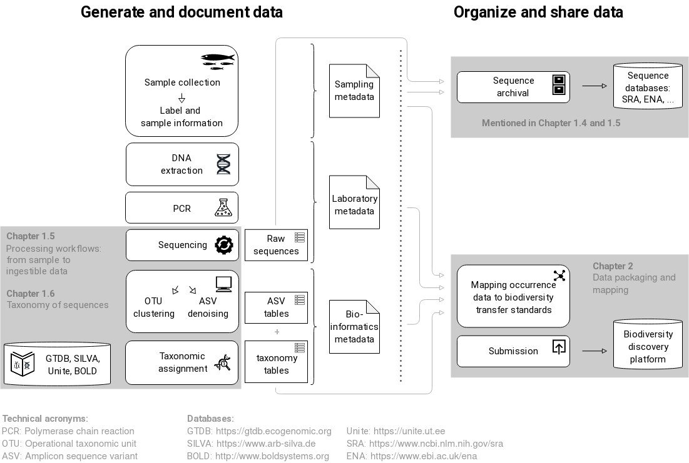
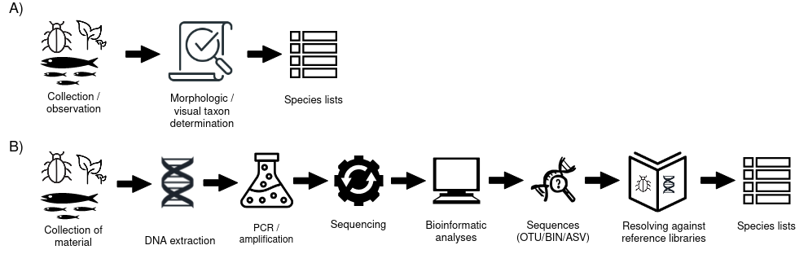
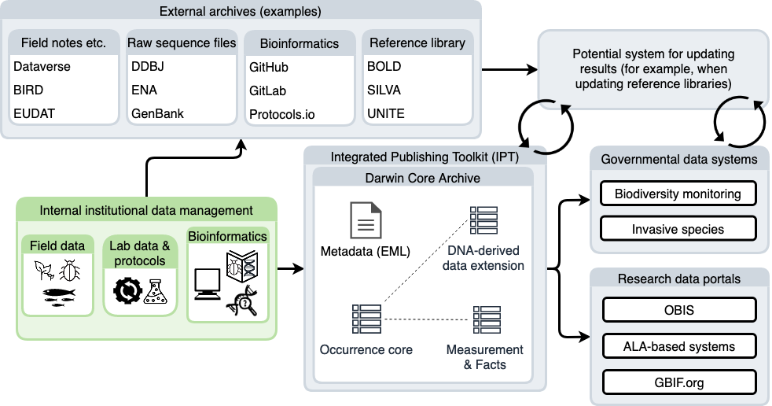
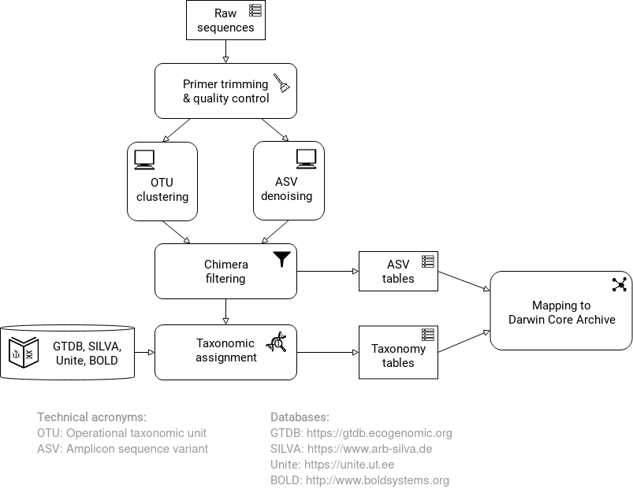

== Introduction 

=== Rationale

The last 20 years have brought an increased understanding of the immense power of molecular methods for documenting the diversity of life on earth. Seemingly lifeless and mundane substrates such as soil and sea water turn out to abound with life–although perhaps not in a way that the casual observer may immediately appreciate. DNA-based studies have shown that organism groups such as fungi, insects, oomycetes, bacteria and archaea are everywhere, although we often cannot observe them physically (https://doi.org/10.1093/femsec/fix023[Debroas et al. 2017^]). The benefits of molecular methods are not restricted to the microscopic world: there are many organisms, such as some fish species, which can at least theoretically be observed physically but for which it is very costly, labour-intensive, and perhaps invasive to seek to do so (https://doi.org/10.1126/sciadv.aap9661[Boussarie et al. 2018^]). In such situations, DNA data enable us to record the presence (and past presence) of these organisms non-invasively and with minimal effort. These developments mean that we do not always need tangible, physical manifestations of all organisms present at some site in order to record them. All organisms, whether or not they are physically observable, may be important when it comes to understanding biodiversity, ecology and biological conservation.

DNA-derived data enable us to record inconspicuous or otherwise unobservable taxa that fall below the radar of vetted protocols for field work, checklists, depositions into natural science collections, etc. The current maturity of DNA methodologies enables us to record the presence of these organisms to a level of detail that exceeds that of macroscopic observations of organisms in general. However, bearing in mind that DNA methodologies comes with their own problems and biases, it is important to use this moment to define and agree how we should record and report on an organism as present in some substrate or locality through molecular data. Doing so will help avoid significant inefficiencies that have been reported in other domains, in which the lack of standards and guidance has led to very heterogeneous and largely incomparable bodies of data (https://doi.org/10.1089/omi.2006.10.231[Leebens-Mack et al. 2006^]; https://doi.org/10.1038/nbt.1823[Yilmaz et al. 2011^]; https://doi.org/10.3897/mycokeys.4.3606[Nilsson et al. 2012^]). Moreover, clear documentation of the computational processing from raw sequence reads to deduced species observation, will enable reanalysis when improved methods appear.

DNA-derived occurrence data of species should be as standardized and reproducible as possible, regardless of whether or not the detected species have formal scientific names. In some cases, such occurrence records will hint at previously unknown geographical and ecological properties of described species, thus enriching our body of knowledge on these taxa. In other cases, the data may allow us to amalgamate and visualize information on currently undescribed species, potentially speeding up their eventual formal description. The ability to collect usable data even for unnamed species adds significantly to the many ways in which GBIF and other biodiversity data platforms index the living world, and make this knowledge available to all and for a variety of purposes, including biodiversity conservation. Recent estimates suggest that at least 85 per cent of all extant species are undescribed (https://doi.org/10.1371/journal.pbio.1001127[Mora et al. 2011^]; https://doi.org/10.1111/cobi.12285[Tedesco et al. 2014^]). Existing data standards have been designed for the minority of taxa that have been described. Good practices for dealing with DNA-derived data will help to characterize occurrences of all organisms, whether described or not.

This guide sets out the ways in which DNA-derived occurrence data should be reported for standardized inclusion in GBIF and other biodiversity data platforms. It does not express any view on the issue of access and benefit sharing for digital sequence information, the subject of extensive discussion through the https://www.cbd.int/abs/[Convention on Biological Diversity^] (CBD). However, it is worth noting that genetic barcodes and metabarcodes are typically genes or non-coding DNA fragments, which are not suitable for commercial exploitation. As the archiving of sequences through http://www.insdc.org/[International Nucleotide Sequence Database Collaboration (INDSC)^] is a widespread norm in sequence-based research, publication of occurrence data originating from sequences does not involve publishing new sequences. In most cases these have already been placed in a public genetic repository. This guide therefore addresses the added value possible from deriving spatio-temporal occurrence data and dna-based names from dna data, rather than the value of the genetic information itself. In addition to dealing with sequence-derived data, this guide also includes suggestions for publishing occurrence data of species derived from qPCR or ddPCR analyses. 

Reporting DNA-derived occurrences in an open and reproducible way brings many benefits: notably, it increases citability, highlights the taxa concerned in the context of biological conservation and contributes to taxonomic and ecological knowledge. Additionally, it also provides a mechanism to store occurrence records of undescribed species. When this yet to be described taxon is finally linked to a new Linnaean name, all these linked occurrence records will be immediately available. Each of these benefits provides a strong rationale for professionals to adopt the practices outlined in this guide, helping them to highlight a significant proportion of extant biodiversity, hasten its discovery and integrate it into biological conservation and policy-making.

=== Target audiences

This guide has been developed for multiple target audiences: students planning a first DNA-based study, researchers with old sequences and abundance tables they want to revive or preserve, biodiversity data specialists who are new to DNA-derived occurrences, and bioinformaticians familiar with sequence data but new to biodiversity data platforms. The guide does not directly target users of molecular data in biodiversity data platforms, but such users may find <<outputs,section 1.7 on Outputs>> particularly interesting. The authors' intention is to provide guidance on publishing data and associated attributes from genetic sequence through general biodiversity data platforms.

The <<figure-workflow,flowchart>> outlines the processing steps involved in publishing amplicon-derived molecular biodiversity data in repositories such as GBIF and national biodiversity data platforms, including those built on the ALA platform. This guide’s focus is primarily on the steps following the arrival of raw <<fastq,FASTQ>> sequences from the sequencing step. By familiarizing themselves with the flowchart—and noting any steps that appear familiar or unclear—users will be able to navigate the content included in the guide.

[[figure-workflow]]
.Overall workflow for DNA sequence-derived biodiversity data as described in this guide.
ifdef::backend-pdf[]

endif::backend-pdf[]
ifndef::backend-pdf[]
image::img/web/sequence-publishing-guide.en.svg[]
endif::backend-pdf[]

We have done our best to present the information in this guide so that it is useful for each of the audiences described above, but background reading (e.g. https://www.gbif.org/publishing-data[GBIF quick guide to data publishing]) may be required in certain cases.

=== Introduction to DNA-derived occurrence data

DNA-derived biological occurrence data include information derived from DNA from individual organisms, but also from environmental DNA (eDNA, i.e. DNA extracted from environmental samples, https://doi.org/10.1016/j.biocon.2014.11.019[Thomsen & Willerslev 2015^]) and from bulk samples comprising many individuals (e.g. plankton samples or Malaise trap samples consisting of multiple individuals from many species). Currently, the greatest volume of DNA-derived occurrence data derives from eDNA. Since analytical methods and end products are largely similar for all sample sources, the discussion below will focus on eDNA (<<category-i>> and <<category-ii>>), noting that the outline is applicable to the other sources. Surveys often utilize targeted sequencing of taxonomically and phylogenetically informative genetic markers, but can also use, for example, qPCR-based approaches that do not directly result in DNA sequence data (<<category-iii>> and <<mapping-ddpcr-qpcr-data>>). This guide may appear heavy in DNA related terms; if this is the case, consult the <<glossary>> before reading further. 

==== Environmental DNA as a source for DNA-derived occurrence data

Environmental DNA has been in use as a term since 1987, when it was first used to describe DNA from microbes in sediment samples (https://doi.org/10.1016/0167-7012(87)90025-x[Ogram et al. 1987^]). eDNA is now more broadly used to describe a complex mix of DNA from different organisms (https://doi.org/10.1093/oso/9780198767220.001.0001[Taberlet et al. 2018^] and https://doi.org/10.1111/j.1365-294X.2012.05542.x[2012^]). Thus, eDNA includes all DNA extracted from a specific environmental sample, regardless of substrate and which species it contains. It may be extracted from a wide range of sources, including skin and hair cells, saliva, soil, faeces, and from living or recently dead organisms (https://doi.org/10.1007/s00374-008-0345-8[Pietramellara et al. 2009^]). Environmental DNA often sufficiently represents all organisms in a given sample. In practice, however, the presence of DNA in the environmental sample depends on the habitat selection, the body size, morphology and activity level of the organism, and the sampling methods used to capture it (https://doi.org/10.1093/oso/9780198767220.001.0001[Taberlet et al. 2018^]) as well as the stage of DNA degradation.

[[figure-sampling-processes]]
.Caricature of sampling processes comparing data collection by A) traditional ecological/biodiversity sampling methods, and B) eDNA-based studies, here exemplified by metabarcoding. This is a simplified representation. For eDNA, most of the steps up to sequencing will involve technical or biological replications to identify contamination and false positives as well as false negative results, making the structure of data and metadata hierarchical. However, studies will often include both types of sampling. For example, if the 'Reference Library' used in B) does not contain all relevant species from a given group of organisms, it will be necessary to go back to A). It may also be that 'Resolving against Reference Library' produced unexpected or unlikely results, in which case further studies using traditional methodology will be required to determine whether the species identified by bioinformatic analysis can be verified.
ifdef::backend-pdf[]

endif::backend-pdf[]
ifndef::backend-pdf[]
image::img/web/sampling-processes.en.svg[]
endif::backend-pdf[]

eDNA is thus a sample type, not a method, including DNA derived from any environmental sample rather than from the capture and sequencing of a targeted individual. Such sample types includes water, soil, sediment and air, but also gut content samples and tissue (plant/animal) where the host DNA is not targeted (https://doi.org/10.1093/oso/9780198767220.001.0001[Taberlet et al. 2018^]). A number of analytical methods exist for studying environmental DNA. These can be divided into two main classes: 1) those which aim to detect a specific organism and 2) those which describe an assemblage or a community of a range of organisms. Different methods of analysis will generate different types and volumes of data. Most often DNA concentrations are low, and technical and biological replicates should be used to validate species detection.

Several studies show that, for water samples, analyses based on eDNA may have a higher probability of finding rare and hard to survey species than conventional methods (https://doi.org/10.1111/j.1365-294X.2011.05418.x[Thomsen et al. 2012^]; https://doi.org/10.1016/j.biocon.2014.11.029[Biggs et al. 2015^]; https://doi.org/10.1111/mec.13428[Valentini et al. 2016^]; https://doi.org/10.1002/edn3.74[Bessey et al. 2020^]). The same may be true in other environments. Therefore, eDNA may be suitable for monitoring rare red list species and undesirable alien species that often have low densities and that are difficult to detect with conventional methods because sometimes DNA traces can still be detected, although the actual organism is no longer present there. Environmental DNA methods are able to detect cryptic organisms, especially those that are small and unable to be detected by the naked eye (e.g. bacteria and fungi). In addition, eDNA can also be used for observation of many species simultaneously, and may describe entire biological communities or major components of them (https://ntnuopen.ntnu.no/ntnu-xmlui/handle/11250/2612638[Ekrem & Majaneva 2019^]).

Some studies show a relationship between the amount of DNA for a given species in an environmental sample and the biomass of the species in the environment. One can therefore potentially also think of environmental DNA allowing a so-called semi-quantitative estimate (indirect target) for organism biomass, both from environmental samples and bulk samples (https://doi.org/10.1371/journal.pone.0035868[Takahara et al. 2012^]; https://doi.org/10.1111/j.1365-294X.2011.05418.x[Thomsen et al. 2012^]; https://doi.org/10.1111/j.1365-294X.2011.05261.x[Andersen et al. 2012^]; https://doi.org/10.1038/ismej.2013.61[Ovaskainen et al. 2013^]; https://doi.org/10.1111/1755-0998.12522[Lacoursière-Roussel et al. 2016^]; https://doi.org/10.1371/journal.pone.0165252[Thomsen et al. 2016^]; https://doi.org/10.1111/mec.13428[Valentini et al. 2016^]; https://doi.org/10.1002/edn3.45[Fossøy et al. 2019^]; https://doi.org/10.1002/edn3.7[Yates et al. 2019^]; https://doi.org/10.1038/s41598-019-40233-1[Doi et al. 2017^]). However, other studies show little correlation between environmental DNA quantity and estimated population density (https://doi.org/10.1016/j.jembe.2018.09.004[Knudsen et al. 2019^]). PCR, quantification, mixing and other biases are frequently debated. For example, moult, reproduction and mass death can contribute to increased levels of crustacean environmental DNA in water, while turbidity and poor water quality reduce the amount of detectable environmental DNA (https://doi.org/10.1111/1365-2664.13404[Strand et al. 2019^]). Therefore we encourage data publishers to supply both read counts per ASV as well as total read count in samples, as this is necessary information for users to make their own conclusions on presence/absence and abundance.

==== DNA-metabarcoding: sequence-derived data

The generation of sequence-derived data is currently increasing fast due to the development of <<barcoding,DNA-metabarcoding>>. This method utilizes general primers to generate thousands to millions of short DNA-sequences for a given group of organisms with the help of high-throughput sequencing (HTS, alt. next-generation sequencing (NGS)). By comparing each DNA-sequence to a reference database such as GenBank (https://doi.org/10.1093/nar/gkj157[Benson et al. 2006 ^]), BOLD (http://dx.doi.org/10.1111/j.1471-8286.2007.01678.x[Ratnasingham et al. 2007^]), or UNITE (https://doi.org/10.1093/nar/gky1022[Nilsson et al. 2009^]), each sequence can be assigned to a species or higher rank taxon identity. <<barcoding,DNA-metabarcoding>> is used for samples originating from both terrestrial and aquatic environments, including water, soil, sediments, biofilms, plankton, bulk samples and faces, simultaneously identifying hundreds of species (https://doi.org/10.1016/j.gecco.2019.e00547[Ruppert et al. 2019^]).

The identification and classification of organisms from sequence data and marker-based surveys depends on access to a reference library of sequences taken from morphologically identified specimens that are matched against the newly generated sequences. The efficacy of classification depends on the completeness (coverage) and the reliability of reference libraries, as well as the tools used to carry out the classification. These are all moving targets, making it essential to apply taxonomic expertise and caution in the interpreting results (<<taxonomy-of-sequences>>). Availability of of all verified <<asv,amplicon sequence variants>> (https://doi.org/10.1038/ismej.2017.119[Сallahan et al. 2017^]) allow for precise reinterpretation of data, intra-specific population genetic analyses (https://doi.org/10.1111/eva.12882[Sigsgaard et al. 2019^]) and is likely to increase identification accuracy.

==== Metagenomic: sequence-derived data

Sequence derived diversity data may also be generated using amplification free metagenomic methods whereby all DNA in a sample is targeted for sequencing (https://doi.org/10.1002/047001153X.g205313[Tyson & Hugenholtz 2005^]), rather than specific amplicons or barcodes, as described above. Sequence derived diversity data obtained from metagenomic sequencing can be in the form of sequence matches to annotated gene databases (as above) or as (near) complete metagenome assembled genomes (MAGs). While metabarcoding methods still dominate in terms of sequence derived diversity information, metagenomic data is becoming more important, as evidenced by the growing number of MAGS and their utility in informing phylogeny and taxonomy (https://doi.org/10.1038/s41587-020-0501-8[Parks et al. 2020^]);  discussion of the rapidly evolving methods associated with metagenome analysis is beyond the scope of this document. This document uses metabarcoding as the model for discussion around concepts and methods for publishing sequence derived diversity data, and while the bioinformatic pathways will differ for metagenomic data, the end result (a sequence, often in the form of a contig/assembly) is congruent with the concepts suggested for metabarcoding data (i.e., sample specific, sample collection, data generation and processing workflow metadata should be captured).

==== qPCR/ddPCR: occurrence data

For the detection of specific species in eDNA-samples, most analyses include species-specific primers and qPCR (Quantitative Polymerase Chain Reaction) or ddPCR (Droplet-Digital Polymerase Chain Reaction). These methods do not generate DNA-sequences, and the occurrence data are completely dependent on the specificity of the primers/assays. Hence, there are strict recommendations for how to validate such assays and the requirements for publishing data (https://doi.org/10.1373/clinchem.2008.112797[Bustin et al. 2009^], https://doi.org/10.1373/clinchem.2013.206375[Huggett et al. 2013^]), as well as the readiness for assays in routine monitoring (https://doi.org/10.1101/2020.04.27.063990[Thalinger et al. 2020^]). Analyses of eDNA-samples using qPCR requires few resources and can be done in most DNA-laboratories. The first example of using eDNA water samples utilized qPCR for detecting the invasive American Bullfrog (_Rana catesbeiana_) (https://doi.org/10.1098/rsbl.2008.0118[Ficetola et al. 2008^]), and qPCR analyses of eDNA water samples are regularly used for detecting specific species of fish, amphibians, molluscs, crustaceans and more, as well as their parasites (https://doi.org/10.1002/edn3.89[Hernandez et al. 2020^], https://doi.org/10.1002/edn3.10[Wacker et al. 2019^], https://doi.org/10.1002/edn3.45[Fossøy et al. 2019^], https://doi.org/10.1007/s10750-017-3408-8[Wittwer et al. 2019^]). eDNA-detections using qPCR thus generate important occurrence data for single species.

=== Introduction to biodiversity publishing

Publishing biodiversity data is largely a process of making species occurrence data findable, accessible, interoperable and reusable, in accordance with the FAIR principles (https://doi.org/10.1038/sdata.2016.18[Wilkinson et al. 2016^]). Biodiversity data platforms help expose and discover genetic sequence data as biodiversity occurrence records alongside other types of biodiversity data, such as museum collection specimens, citizen science observations, and classical field surveys. The structure, management and storage for each original data source will vary according to the needs of each community. The biodiversity data platforms support data discovery, access and reuse by making these individual datasets compatible with each other, addressing taxonomic, spatial and other inconsistencies in the available biodiversity data. Making data available through single access points supports large-scale data-intensive research, management, and policy. The compatibility between datasets is reached through the process of standardization.

A number of data standards are in use for general biodiversity data (https://www.gbif.org/standards), and a separate set of standards for genetic sequence data (see <<mixs,MIxS>> and <<ggbn,GGBN>>). This guide reflects some ongoing efforts for increasing the compatibility between standards for general biodiversity and genetic data. Standards often highlight the subsets of fields which are most important or most frequently applicable. These subsets may be referenced as “cores”. The preferred format for publishing data in the GBIF and ALA networks is currently the Darwin Core Archive (DwC-A) using the https://dwc.tdwg.org/[Darwin Core^] (DwC) data standard. In practice, this is a compressed folder (a zip file) containing data files, in standard comma- or tab-delimited text format, a metadata file (https://eml.ecoinformatics.org/[eml.xml]) that describes the data resource, and a metafile (meta.xml) that specifies the structure of files and data fields included in the archive. Standardized packaging ensures that the data can travel between systems using specific data exchange protocols.  <<data-packaging-and-mapping,Section 2>> of this guide provides recommendations for the mapping of the data files, while guidelines and tools for constructing the xml files can be found here: https://www.tdwg.org/standards[TDWG^], https://www.gbif.org/standards[GBIF^], and https://support.ala.org.au/support/solutions/articles/6000195499-what-are-biodiversity-data-standards-[ALA^].

A central part of the standardization process is the mapping of fields, which is required to transform the original field (column) structure in a source-data export into a standard field structure. Standardization may also affect the content of the individual fields within each record, for example, by recalculating coordinates to a common system, rearranging date elements, or mapping the contents of fields a standard set of values, often called a vocabulary. The process of standardization also provides an opportunity to improve data quality, for example, by filling in omissions, correcting typos and extra spaces and handling inconsistent use of fields. Such improvements enhance the quality of data and increase its suitability for reuse, but at the same time, data published in any state are better than data that remain unpublished and inaccessible. Standartization is typically applied to a copy or to an export from the data source, leaving the original untouched.

[[figure-publication]]
.Outline of a platform for reporting and publishing DNA sequences and associated metadata (green box) based on existing systems and data standards (grey boxes). An envisioned system for regular (based on machine-to-machine reading of data) update of results (white box) can either read and update the Darwin Core Archive or various administration systems. The data transfer between the various elements (black arrows) will require various degrees of data transformation and harmonization and may include either mechanical or human quality assessment.
ifdef::backend-pdf[]

endif::backend-pdf[]
ifndef::backend-pdf[]
image::img/web/outline-of-a-platform.en.svg[]
endif::backend-pdf[]

Once a dataset has been through these standardization and data quality processes, it should be placed in an accessible online location and associated with relevant metadata. Metadata–data or information about the dataset includes key parameters that describe the dataset and further improve its discoverability and reuse. Metadata should include other important elements such as authorship, Digital Object Identifiers (DOIs), organizational affiliations and other provenance information, as well as procedural and methodological information about how the dataset was collected and curated. We encourage to provide a description of workflow details and versions including quality control in the https://eml.ecoinformatics.org/schema/eml-dataset_xsd.html#DatasetType_methods[methods section] in the EML file.

Datasets and their associated metadata are indexed by each data portal: this process enables users to query, filter and process data through APIs and web portals. Unlike journal publications, datasets may be dynamic products that go through multiple versions, with an evolving number of records and mutable metadata fields under the same title and DOI.

Note that holders of genetic sequence data are expected to upload and archive genetic sequence data in raw sequence data repositories such as NCBI’s https://www.ncbi.nlm.nih.gov/genbank/submit/[SRA^], EMBL’s https://biodiversitydata-se.github.io/mol-data/ena-metabar.html[ENA^] or https://www.ddbj.nig.ac.jp/submission-e.html[DDBJ^]. The sequence archival topic is not covered here, but e.g. https://doi.org/10.3897/rio.3.e12431[Penev et al. (2017)] provide a general overview of the importance of data submission and guidelines in connection with scientific publication. Biodiversity data platforms such as ALA, GBIF, and most national biodiversity portals are not archives or repositories for raw sequence reads and associated files. We do, however, stress the importance of maintaining links between such primary data and derived occurrences in <<data-packaging-and-mapping,Section 2>>.

=== Processing workflows: from sample to ingestible data 

Metabarcoding data can be produced from a number of different sequencing platforms (Illumina, PacBio, Oxford Nanopore, Ion Torrent, etc.) that rely on different principles for readout and generation of data that differ with respect to read length, error profile, whether sequences are single or paired-end, etc. Currently the Illumina short-read platform is the most widely adopted and as such is the basis of the descriptions here. However, the bioinformatics processing of the data follows the same general principles (QC, denoising, classification) regardless of the sequencing technology used (https://doi.org/10.3389/fmicb.2017.01561[Hugerth et al. 2017^], <<figure-sampling-processes>>).

[[figure-processing]]
.Outline of bioinformatic processing of metabarcoding data.
ifdef::backend-pdf[]

endif::backend-pdf[]
ifndef::backend-pdf[]
image::img/web/outline-of-bioinformatic-processing.en.svg[]
endif::backend-pdf[]

Typically, the DNA sequences are first pre-processed by removing primer sequences and, depending on the sequencing method used, low quality bases, usually toward the 5’ and 3’ sequence ends. Sequences not fulfilling requirements on length, overall quality, presence of primers, tags etc. are removed.

The pre-processed sequences can then be assigned a taxon by comparing them against reference databases. When reference databases are incomplete, sequences classification can be done without taxonomic identifications, either by clustering sequences into operational taxonomic units based on their similarity (OTUs; https://doi.org/10.1098/rstb.2005.1725[Blaxter et al. 2005^]) or by denoising the data, i.e. explicitly detecting and excluding PCR/sequencing errors sequences to produce amplicon sequence variants (ASV; also referred to as zero radius OTU (zOTU)). Denoising attempts to correct errors that have been introduced in the PCR and/or sequencing steps, such that the denoised sequences are the set of unique biologically real sequences present in the original sequence mixture. In case of paired-end sequences, the forward and reverse sequences may be denoised separately before merging or else merged prior to denoising. ASVs in the resulting set can differ by as little as one base which is indicative of inter- or intraspecific species variation. Operationally, ASVs may be thought of as OTUs without defined radius and while denoising algorithms are typically very good, they do not entirely remove the problems of over-splitting or lumping sequences. 

The PCR used for generating the sequencing library can result in the generation of artefactual sequences in the form of chimeras; a single sequence that originates from multiple parent sequences. Such sequences can be detected bioinformatically and removed, and this is typically done after OTU clustering or denoising.

Finally, the pre-processed sequences, OTUs or ASVs, are taxonomically classified by comparing them to a database of annotated sequences (often referred to as reference libraries, see <<taxonomy-of-sequences>>). As with the previous steps, several alternative methods are available. Most of these are either based on aligning the metabarcoding sequences to the reference sequences or on counting shared k-mers (short exact sequences).

Several open source tools and algorithms exist for bioinformatic processing of metabarcoding data (QIIME2 https://doi.org/10.1038/s41587-019-0209-9[(Bolyen et al. 2019)^], DADA2 https://doi.org/10.1038/nmeth.3869[(Callahan et al. 2016)^], SWARM https://doi.org/10.7717/peerj.593[(Mahé et al. 2014)^], USEARCH https://doi.org/10.1093/bioinformatics/btq461p[(Edgar 2010)^], Mothur https://doi.org/10.1128/AEM.01541-09[(Schloss et al. 2009)^], LULU https://doi.org/10.1038/s41467-017-01312-x[(Frøslev et al. 2017)^], PROTAX https://doi.org/10.1093/bioinformatics/btw34[(Somervuo et al. 2016)^]). Given the existence of many popular and well used workflows, we make some recommendations below on analysing data for submission to biodiversity data platforms. This is not to suggest that these are the best methods or most appropriate for all purposes but is an attempt to encourage submission of relatively standardized data that may readily be compared via the platforms. If possible, a well documented and maintained workflow should be used (e.g. https://nf-co.re/ampliseq[nf-core/ampliseq pipeline]). Metadata should include workflow details and versions either in the metadata method steps or as a reference in the SOP field in the DNA derived data extension (see mapping in <<table-04,Table 4>>). Sequence data should be deposited in an appropriate nucleotide archive (NCBI’s SRA: https://doi.org/10.1093/nar/gkq1019[Leinonen et al. 2011^]) or EMBL’s ENA (https://doi.org/10.1093/nar/gkz1063[Amid et al. 2020^])) and data submitted to the biodiversity platform should include the biosample ID obtained from the archive (see data mapping in <<data-mapping>>). Making use of these sample IDs will reduce the chances of duplication and ensure sequence data are readily obtainable should opportunities for re-analysis arise, as reference libraries and bioinformatic tools improve. The core end-product of these pipelines is typically a file of counts of individual OTUs or ASVs in each sample along with the taxonomy assigned to these. This is generated either in tabular format or in the BIOM format (https://doi.org/10.1186/2047-217X-1-7[McDonald et.al 2012^]). OTU or ASV sequences are also usually provided in the FASTA format (https://doi.org/10.1073/pnas.85.8.2444[Pearson & Lipman 1988^]).

=== Taxonomy of sequences

Taxonomic annotation of sequences is a critical step in the processing of molecular biodiversity datasets, as scientific names are key to accessing and communicating information about the observed organisms. The accuracy and precision of such sequence annotation will depend on the availability of reliable reference databases and libraries across all branches of the tree of life, which in turn will require joint efforts from taxonomists and molecular ecologists. Public sequence databases should always be used knowingly of the fact that they suffer from various shortcomings related to, e.g., taxonomic reliability and lack of standardized metadata vocabularies (https://doi.org/10.1007/s13225-019-00428-3[Hofstetter et al. 2019^]; https://doi.org/10.3897/mycokeys.72.56691[Durkin et al. 2020^]).

Species, as described by taxonomists, are central to biology and attempts at characterizing biodiversity may therefore make use of the end products of taxonomic research. However, unlike DNA sequence data, taxonomic outputs are not always readily amenable to direct algorithmic or computational interpretation: classical taxonomy is a human-driven process which includes manual steps of taxon delimitation, description and naming, culminating in a formal publication in accordance to the international Codes of Nomenclature. As discussed in previous chapters, DNA sequence-based surveys are very effective at detecting hard to observe species and will often identify the presence of organisms currently outside traditional Linnaean taxonomic knowledge. While these guidelines do not address the publication of alternative species checklists derived from sequence data, the disconnection between traditional taxonomy and eDNA efforts is undesirable. Therefore we offer the following recommendations to readers of this guide.

As taxonomy is central to the discovery of biodiversity data, it is highly recommended that any eDNA sequencing efforts should seek to include relevant taxonomic expertise in their study. It will similarly be beneficial if eDNA sequencing studies are able to allocate a portion of their budget to generation and release of reference sequences from previously unsequenced type specimens or other important reference material from the local herbarium, museum, or biological collection. Taxonomists, too, can contribute towards this goal by always including relevant DNA sequences with each new species description (https://doi.org/10.1093/sysbio/syaa026[Miralles et al. 2020^]) and by targeting the many novel biological entities unravelled by eDNA efforts (e.g. https://doi.org/10.1186/s40168-017-0259-5[Tedersoo et al. 2017^]).

Most current biodiversity data platforms are organized around traditional name lists and taxonomic indexes. As DNA sequence-derived occurrences are rapidly becoming a significant source of biodiversity data, and as official taxonomy and nomenclature for such data lags, it is recommended that data providers and platforms should continue to explore and include more flexible representations of taxonomy into their taxonomic backbones. These new representations include molecular reference databases (e.g., GTDB, BOLD, UNITE) that recognize sequence data as reference material for previously unclassified organisms. Additionally, we suggest other commonly used molecular databases (e.g., PR2, RDP, SILVA) should develop stable identifiers for taxa and make reference sequences available for those taxa, to allow their use as taxonomic references. 

In contrast to classical taxonomy, which is a heavily manual process, clustering DNA sequences into taxonomic concepts relies on algorithmic analysis of similarity and other signals (such as phylogeny and probability), as well as some human editing. The resulting OTUs vary in stability, presence of reference sequences and physical material, alignments and cut-off values, and OTU identifiers such as DOIs (https://doi.org/10.1093/nar/gky1022[Nilsson et al. 2019^]). Even more importantly, they vary in scale, from local study- or project-specific libraries to global databases that enable broader cross-study comparison. In contrast to the centralization and codification of Linnaean taxa that are formally described in research publications, OTUs are distributed across multiple evolving digital reference libraries that differ in taxonomic focus, barcode genes and other factors. By associating standard sequences with identified reference specimens, BOLD and UNITE are establishing an essential mapping layer for linking ASVs and OTUs with the foundations of the Linnaean taxonomic framework. The GBIF backbone taxonomy includes identifiers for UNITE Species Hypotheses as well as Barcode index numbers which allows indexing of species occurrence data taxonomically annotated at the OTU level for Fungi and Animals (https://www.gbif.org/news/2LrgV5t3ZuGeU2WIymSEuk/adding-sequence-based-identifiers-to-backbone-taxonomy-reveals-dark-taxa-fungi[GBIF secretariat 2018^], https://data-blog.gbif.org/post/gbif-backbone-taxonomy[Grosjean 2019^]).

Algorithms for taxonomic annotation of eDNA will typically assign each unique sequence to the nearest taxonomic group in a reference set, based on some criteria for relatedness and confidence. For poorly known groups of organisms, such as prokaryotes, insects and fungi, the annotation may be a non-Linnaean placeholder name for a (cluster-based) taxon, and this taxon may represent a species or even a taxonomic unit above the species level. No reference database contains all species in a given group due to the many unknown, unidentified, and yet undescribed species on earth. Frequent neglections of this fact has been the source of numerous taxonomic misidentifications during the last 30 years.

During import into the biodiversity platform, the taxonomic resolution for these occurrences may be reduced even further, as the reference set used for annotation may not be included in the taxonomic index of that platform. Records assigned to a well defined cluster within a genus are likely to be treated as undefined records of that genus. The inclusion of the underlying sequence within or by reference in each record will allow future users to potentially identify the organism to a greater level of granularity, particularly as reference libraries improve over time. In cases where the underlying sequence cannot be included as part of the submitted data, we advocate deposition of a (scientific or placeholder) name of the taxon plus an MD5 checksum of the sequence as a unique taxon ID (see xref:data-mapping[xrefstyle="full"]). MD5 checksums are unidirectional hash algorithms commonly used for verifying file integrity (ref). In this case, they would provide a unique and repeatable representation of the original sequence that would nevertheless not allow the sequence itself to be recovered. This may be required in cases where sensitivity exists around access. MD5 checksums enable efficient query to determine whether the same exact sequence has been recovered in other eDNA efforts, but it is not a complete replacement of the sequence as MD5s do not enable further analyses. Two sequences differing by even a single base will get two completely different MD5 checksums, such that BLAST-style sequence similarity searches will not work.

=== Outputs

The purpose of exposing DNA-derived data through biodiversity platforms is to enable reuse of these data in combination with other biodiversity data types. It is very important to keep this reuse in mind when preparing your data for publication. Ideally, the metadata and data should tell a complete story in such a way that new, uninformed users can use this evidence without any additional consultations or correspondence. Biodiversity data platforms provide search, filtering, browsing, visualizations, data access, and data citation functionality. For metabarcoding data we encourage users to configure filters for organismQuantity, organismQuantityType, sampleSizeValue, sampleSizeUnit. These can be used exclude singletons and/or set thresholds for relative number of sequence reads within a sample (<<mapping-metabarcoding-edna-and-barcoding-data>>). Users can often choose data-output formats (e.g. DwC-A, CSV) and then process, clean and transform data into the shape and format needed for the analyses.

At GBIF.org or through the GBIF API, registered users can search, filter, and download biodiversity data in the following three formats: 

* *Simple*: a simple, tab-delimited format which includes only the GBIF-interpreted version of the data, as a result of the indexing process. This is suitable for quick tests and direct import into spreadsheets. 
* *Darwin Core Archive*: richer format that includes both the interpreted data and the original verbatim version provided by the publisher (prior to indexing and interpretation by GBIF). Because it includes all the metadata and issue flags, this format provides a richer view of the downloaded dataset. 
* *Species list*: a simple table format that includes only an interpreted list of unique species names from a dataset or query result. 

Regardless of the selected format, each GBIF user download receives a reusable link to the query and a data citation that includes a DOI. This DOI-based citation system provides the means of recognizing and crediting uses to datasets and data originators, improving both the credibility and transparency of the findings based on the data. It is essential to follow data citation recommendations and use DOIs, as good data citation culture is not only the academic norm, but also a powerful mechanism for crediting acknowledging and, therefore, incentivizing data publishers.
