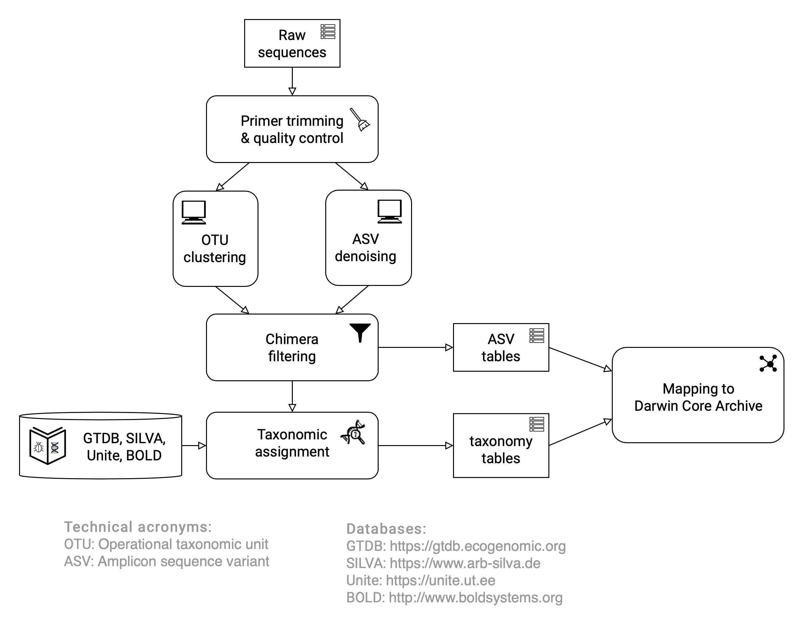

== Introduction 

=== Rationale

The last 20 years have brought an increased understanding of the immense power of molecular methods for documenting the diversity of life on earth. Seemingly sterile and mundane substrates such as soil and sea water turn out to abound with life–although perhaps not in a way that the casual observer may immediately appreciate. DNA-based studies have shown that organism groups such as fungi, insects, oomycetes, bacteria and archaea are everywhere, although we often cannot observe them physically (https://doi.org/10.1093/femsec/fix023[Debroas et al. 2017^]). The benefits of these methods are not restricted to the microscopic world: there are many organisms, such as some fish species, that are at least theoretically possible to observe physically but very costly, labour-intensive, and perhaps invasive to seek to do so (https://doi.org/10.1126/sciadv.aap9661[Boussarie et al. 2018^]). In such situations, DNA sequence data enables us to record the presence (and past presence) of these organisms non-invasively and with minimal effort. These developments mean that we do not always need tangible, physical manifestations of all organisms present at some site in order to record them. All organisms, whether or not they are physically observable, may be important when it comes to understanding biodiversity, ecology and biological conservation.

Sequence-derived data enables us to record inconspicuous or otherwise unobservable taxa that fall below the radar of vetted protocols for field work, checklists, depositions into natural science collections, and so on. The current maturity of DNA methodologies puts us in a position to record the presence of these organisms to a level of detail that exceeds that of macroscopic observations of organisms in general. It is important to use this moment to define and agree how we should record and report on an organism as present in some substrate or locality through molecular data. Doing so will avoid the disorder that has occurred in other domains, in which the lack of standards and recommendations have led to very heterogeneous and largely incomparable bodies of data (https://doi.org/10.1089/omi.2006.10.231[Leebens-Mack et al. 2006^]; https://doi.org/10.1038/nbt.1823[Yilmaz et al. 2011^]; https://doi.org/10.3897/mycokeys.4.3606[Nilsson et al. 2012^]).

DNA-derived occurrence data of species should be as standardized and reproducible as possible, regardless of whether the underlying species have formal scientific names or not. In some cases, these occurrence records will hint at previously unknown geographical and ecological properties of described species, thus enriching our body of knowledge on these taxa. In other cases, the data will allow us to amalgamate and visualize information on as-yet undescribed species, potentially speeding up their eventual formal description. This facet represents a major addition to the many ways in which GBIF and other biodiversity data platforms index the living world, and it is a change that will benefit researchers, policymakers, and other users of biodiversity data. Recent estimates suggest that at least 85 per cent of all extant species are undescribed, while existing data standards have been designed for the minority of taxa that have been described: good practices for dealing with DNA-derived data helps to characterize occurrences of all organisms, whether described or not (https://doi.org/10.1371/journal.pbio.1001127[Mora et al. 2011^]; https://doi.org/10.1111/cobi.12285[Tedesco et al. 2014^]).

This guide sets out the way in which DNA-derived occurrence data should be reported for standardized inclusion in GBIF and other biodiversity data platforms. It does not express any view on the issue of the sharing of benefits arising from access to digital sequence information, the subject of extensive discussion through the https://www.cbd.int/abs/[Convention on Biological Diversity^] (CBD). However, it is worth noting that genetic barcodes and metabarcodes are typically short fragments of non-coding or coding genes, which are not suitable for commercial exploitation. As the archiving of sequences through http://www.insdc.org/[International Nucleotide Sequence Database Collaboration (INDSC)^] is a widespread norm in sequence-based research, publication of occurrence data originating from sequences does not involve publishing new sequences, as in most cases they are already in a public genetic repository. Therefore, the added value of publishing sequence-derived data relates to spatio-temporal occurrences and sequence-based names, and not to the genetic information itself.

Reporting sequence-derived occurrences in an open and reproducible way has a wide range of benefits: notably, it increases citability, highlights the taxa concerned in the context of biological conservation and contributes to taxonomic and ecological knowledge. All three of these benefits provide a strong rationale for professionals to adopt the practices outlined in this guide, helping them to highlight a most important proportion of extant biodiversity, speeding up its discovery rate and integration into biological conservation and policymaking.

=== Target audiences

This guide addresses multiple target audiences: students planning a first sequence-based study, researchers with old sequences and abundance tables they want to revive, biodiversity data specialists who are new to sequence-derived occurrences, and bioinformaticians familiar with sequence data but new to biodiversity data platforms. The guide does not directly target users of molecular data in biodiversity data platforms, but such users may find <<outputs,section 1.7 on Outputs>> particularly interesting. The authors' intention is to provide a guide about how to get genetic sequence data and associated attributes published through general biodiversity data platforms.

The <<figure-01,flowchart>> outlines the processing steps involved in publishing amplicon-derived molecular biodiversity data in repositories such as GBIF and national biodiversity data platforms such as those built on the ALA platform. This guide’s focus is primarily on the steps following the arrival of raw <<fastq,FASTQ>> sequences from the sequencing step. Familiarizing oneself with the flowchart—and making a note of which steps appear familiar to you and which do not—will help users navigate the guide.

[[figure-01]]
.Overall workflow for sequence-derived biodiversity data as described in this guide.
image::img/web/figure-01.png[]

We have done our best to present the information in this guide so that it is useful for anyone included within the audiences described above, but background reading (e.g. https://www.gbif.org/publishing-data[GBIF quick guide to data publishing]) may be required in certain cases.

=== Introduction to sequence-derived occurrence data

Sequence derived biological occurrence data includes environmental DNA (eDNA) (DNA extracted from environmental samples or, rather than from individual organisms (https://doi.org/10.1016/j.biocon.2014.11.019[Thomsen and Willerslev 2015^]) and, from bulk samples comprising many individuals (e.g. plankton samples or Malaise trap samples consisting of multiple individuals from many species). The most common form of sequence-derived occurrence data is currently that derived from eDNA, and because the analysis methods and end products are very similar between the different sample sources, the discussion below will focus on eDNA (<<category-i-sequence-derived-occurrences,§2.1.1>> and <<category-ii-enriched-occurrences,§2.2.1>>), noting that it is applicable to the other sources.

These methods often utilize targeted sequencing of taxonomically and phylogenetically informative genetic markers, but can also be used, for example, in qPCR-based approaches that do not directly result in DNA sequence data (<<category-iii-targeted-species-detection-qpcr,§3.1.3>> and <<mapping-ddpcr-qpcr-data,§3.2.3>>). Environmental DNA is a relatively new concept as it is currently understood, but the term has been in use since 1987, when used to describe DNA from microbes in sediment samples (https://doi.org/10.1016/0167-7012(87)90025-x[Ogram, Sayler, and Barkay 1987^]). eDNA is now more broadly used to describe a complex mix of DNA from different organisms (https://doi.org/10.1093/oso/9780198767220.001.0001[Taberlet et al. 2018^] and https://doi.org/10.1111/j.1365-294X.2012.05542.x[2012^]). Thus, eDNA is all DNA extracted from a specific environmental sample, regardless of the substrate of the sample and which species it contains. DNA in the environment can be derived from various sources, including skin and hair cells, saliva, soil, feces, and from living or recently dead organisms (https://doi.org/10.1007/s00374-008-0345-8[Pietramellara et al. 2009^]). Environmental DNA often sufficiently represents all organisms in a given sample. In practice, however, the presence of DNA in the environmental sample depends on the body size of the organism, morphology, activity level, habitat selection and sampling methods used to capture it (https://doi.org/10.1093/oso/9780198767220.001.0001[Taberlet et al. 2018^]).

[[figure-02]]
.Caricature of sampling process where data is collected by A) traditional ecological/biodiversity sampling methods, and B) eDNA-based studies, here exemplified by metabarcoding. It is stressed that this is a simplifiede representation. for eDNA, most of the steps up to sequencing will involve technical or biological representations, making the structure of data and metadata hierarchical. However, studies will often include bothtypes of sampling. For example, if it turns out that B) 'Resolving against Reference Library' does not contain all species in a given group of organisms, it is necessary to go back to A). It may also be that 'Resolving against Reference Library' gives surprising results and further studies using traditional methodology are needed to confirm or refute whether the resulting species identified by bioinformatic analysis can be verified.
image::img/web/figure-02.png[]

Several studies show that for water samples, analyses based on eDNA may have a higher probability of finding rare and cryptic species than conventional methods (https://doi.org/10.1111/j.1365-294X.2011.05418.x[Thomsen et al. 2012^]; https://doi.org/10.1016/j.biocon.2014.11.029[Biggs et al. 2015^]; https://doi.org/10.1111/mec.13428[Valentini et al. 2016^]; https://doi.org/10.1002/edn3.74[Bessey et al. 2020^]). The same may be true for other environmental samples. Therefore, eDNA may be suitable for monitoring rare red list species and undesirable alien species that often have low densities and that are difficult to detect with conventional methods. Environmental DNA methods are able to detect cryptic organisms, especially those that are small and unable to be detected by the naked eye (e.g. bacteria and fungi). In addition, eDNA can also be used for observation of many species simultaneously, and may describe all or components of biological communities (https://ntnuopen.ntnu.no/ntnu-xmlui/handle/11250/2612638[Ekrem & Majaneva 2019^]).

Identification and classification of organisms from sequence data and marker-based surveys is dependent upon a reference library of known organisms to match the newly generated sequences to. The efficacy of classification depends on the completeness (coverage) and the reliability of reference libraries, as well as the tools used to carry out the classification. All of these are moving targets, making taxonomic expertise and caution important qualities in the assessment of the results (<<taxonomy-of-sequences,§2.6>>). Availability of ASVs is fundamental for subsequent re-identifications and improvements of identification accuracy.

Some studies show a relationship between the amount of DNA in an environmental sample and the biomass of the species in the environment. One can therefore potentially also think of environmental DNA allowing a so-called semi-quantitative estimate (indirect target) for organism biomass, both from environmental samples and bulk samples (https://doi.org/10.1371/journal.pone.0035868[Takahara et al. 2012^]; https://doi.org/10.1111/j.1365-294X.2011.05418.x[Thomsen et al. 2012^]; https://doi.org/10.1111/j.1365-294X.2011.05261.x[Andersen et al. 2012^]; https://doi.org/10.1038/ismej.2013.61[Ovaskainen et al. 2013^]; https://doi.org/10.1111/1755-0998.12522[Lacoursière-Roussel, Rosabal, and Bernatchez 2016^]); https://doi.org/10.1371/journal.pone.0165252[Thomsen et al. 2016^]; https://doi.org/10.1111/mec.13428[Valentini et al. 2016^]; https://doi.org/10.1002/edn3.45[Fossøy et al. 2019^]; https://doi.org/10.1002/edn3.7[Yates, Fraser, and Derry 2019^]; https://doi.org/10.1038/s41598-019-40233-1[Doi et al. 2017^]). However, other studies show little correlation between environmental DNA quantity and estimated population density (https://doi.org/10.1016/j.jembe.2018.09.004[Knudsen et al. 2019^]), and PCR, quantification, mixing and other biases are frequently debated. For example, shell change, reproduction and mass death can contribute to increased levels of crustacean environmental DNA in water, while turbidity and poor water quality reduce the amount of detectable environmental DNA (https://doi.org/10.1111/1365-2664.13404[[Strand et al. 2019^]). Similarly, large multicellular organisms are likely to shed more eDNA than microscopic ones (https://doi.org/10.1371/journal.pone.0130324[Elbrecht & Leese 2015^]). Quantitative estimates of population sizes based on environmental DNA will therefore require more testing before it becomes a widespread and accepted method. Without careful calibration, biological observations derived from eDNA should be thought of "observed presences" or perhaps "relative abundances" (where relative refers to among all the observations made from a particular sample and assay), rather than reliably indicating actual abundance or absence.

Environmental DNA is thus a sample type, not a method. The starting point for eDNA investigations, therefore, includes DNA taken from any environmental sample where the DNA of a captured individual is not specifically targeted in the field. This includes water, soil, sediment and air, but also stool samples and tissue (plant/animal) where the host DNA is not targeted (https://doi.org/10.1093/oso/9780198767220.001.0001[Taberlet et al. 2018^]). Note, however, that choice of PCR primers sets taxonomic limits and introduces biases to signals of community compositions and abundances. A number of analytical methods exist for studying environmental DNA. You can divide these into two main types where one wants to 1) detect a specific organism or 2) describe a community of a range of organisms. Different methods of analysis will generate different types and volumes of data. Most often DNA concentrations are low, and technical and biological replicates should be included to validate species detection.

=== Introduction to biodiversity publishing

Publishing biodiversity data is largely a process of making species occurrence data findable, accessible, interoperable and reusable, in accordance with the FAIR principles (https://doi.org/10.1038/sdata.2016.18[Wilkinson et al. 2015^]). Biodiversity data platforms help expose and discover genetic sequence data as biodiversity occurrences alongside other types of biodiversity data, such as museum collection specimens, citizen science observations, among others. However, the structure, management and storage of data often varies between different original data sources as a reflection of the local data needs, implying that data discovery, access and reuse requires making individual datasets compatible with each other. This is an important endeavour, as publishing sequence-derived data in biodiversity data platforms help address global taxonomic, spatial and other inconsistencies in the current global biodiversity data, by making data available through single access points for large-scale data-intensive research, management, and policy. The compatibility between datasets is reached through the process of standardization.

There are a number of data standards for general biodiversity data, and a separate set of standards for genetic sequence data. Standards often have subsets of the most important or most frequent sets of fields, which are called “cores”. The preferred format for publishing data in the GBIF and ALA networks is the Darwin Core Archive (DwC-A). In practice, this is a compressed folder (a zip file) containing data files, in standard comma- or tab-delimited text format, a metadata file (eml.xml) that describes the data resource, and a metafile (meta.xml) that specifies the structure of files and data fields included in the archive. <<data-packaging-and-mapping,Section 2>> of this guide provides recommendations for the mapping of the data files, while guidelines and tools for constructing the xml files can be found here: https://doi.org/10.1038/sdata.2016.18[Darwin Core^] (DwC) or https://www.tdwg.org/standards[TDWG^], https://www.gbif.org/standards[GBIF^], and https://support.ala.org.au/support/solutions/articles/6000195499-what-are-biodiversity-data-standards-[ALA^].

A central part of standardization is field mapping, which is required to transform the original field (column) structure in a source-data export into a standard field structure. Standardization may also affect the content of the individual fields within each record, for example, by recalculating coordinates to a common system, rearranging date elements, or mapping the contents of fields a standard set of values, often called a vocabulary. The process of standardization also provides an opportunity to improve data quality, for example, by filling in omissions, correcting typos and extra spaces and handling heterogeneities and outliers. Such improvements improve the quality of data and increase its suitability for reuse, but at the same time, data published in any state is better than data that is unpublished and inaccessible.

[[figure-03]]
.Norwegian-to-English translation needed.
image::img/web/figure-03.png[]

Standardized biodiversity data and associated metadata are often packaged into particular formats for efficient functioning of the databases and portal. An example of such a package is the Darwin Core Archive (DwC-A) which is detailed in <<data-packaging-and-mapping,§3>>. Packaged standardized biodiversity data–in the case of DwC-A, a compressed archive (a zip file) containing data, metadata and a file describing the structure of the archive–can travel between systems using specific data exchange protocols.

Once a dataset has been through the standardizаtion and data quality processes, it needs to be placed in an online location and attributed with metadata. Metadata–data or information about the dataset–includes the set of key parameters describing a dataset that further improves its discoverability and reuse. Metadata contains other important elements such as authorship, Digital Object Identifiers (DOIs), organizational affiliations and many other provenance parameters, as well as procedural and methodological information about how the dataset was collected and curated.

Datasets and their associated metadata are indexed by each data portal: this process enables users to search and query the data and apply filters and other data-access features through APIs or web portals. Unlike journal publications, datasets are dynamic products that can have multiple versions, an evolving number of records and non-immutable metadata fields under the same title and DOI.

Note that most holders of genetic sequence data are expected to upload and archive genetic sequence data in raw sequence data repositories such as NCBI’s https://www.ncbi.nlm.nih.gov/genbank/submit/[SRA^] or EMBL’s https://biodiversitydata-se.github.io/mol-data/ena-metabar.html[ENA^], a topic that is not covered here. Biodiversity data platforms such as ALA, GBIF, and most national biodiversity portals are not archives or repositories for raw sequence reads and associated files. We do, however, stress the importance of maintaining links between such primary data and derived occurrences in <<data-packaging-and-mapping,Section 2>>.

=== Processing workflows: from sample to ingestible data 

Metabarcoding data can be produced with a number of different sequencing platforms (Illumina, PacBio, Oxford Nanopore, Ion Torrent, etc.) that rely on different principles for readout and generation of data that differ with respect to read length, error profile, whether sequences are single or paired-end, etc. Currently the Illumina short read platform is the most developed and as such is the basis of the below descriptions, however, the bioinformatics processing of the data follows the same general principles (QC, denoising, classification) regardless of the sequencing technology used (https://doi.org/10.3389/fmicb.2017.0156[Hugerth et al. 2017^], <<figure-02,Figure 2>>).

[[figure-04]]
.Outline of bioinformatic processing of metabarcoding data.

Typically, the DNA sequences are first pre-processed by removing primer sequences and, depending on the sequencing method used, low quality bases, usually toward the 5’ and 3’ sequence ends. Sequences not fulfilling requirements on length, overall quality, presence of primers, etc. are typically removed.

The pre-processed sequences can thereafter be classified into taxa using reference databases (closed reference methods), or processed further to taxonomy independent abundances (open reference methods). Open reference methods are perhaps the most common and require either clustering of sequences into operational taxonomic units (OTUs; https://doi.org/10.1098/rstb.2005.1725[Blaxter et al. 2005^]) of some defined sequence similarity, or denoising sequences to produce amplicon sequence variants (ASV; also referred to as zero radius OTU (zOTU)). Denoising attempts to correct errors that have been introduced in the PCR and/or sequencing steps, such that the denoised sequences are the set of unique biologically real sequences present in the original sequence mixture. In case of paired-end sequences, the forward and reverse sequences may be denoised separately and merged or merged prior to denoising. The resulting set of amplicon sequence variants (ASVs; https://doi.org/10.1038/ismej.2017.119[Сallahan et al. 2017^]) can differ by as little as one base. Operationally, ASV's may be thought of as OTU's without defined radius and while denoising algorithms are typically very good, they do not entirely remove the problems of over-splitting or lumping sequences. 

The PCR used for generating the sequencing library can result in the generation of artefactual sequences in the form of chimeras; a single sequence that originates from multiple parent sequences. Such sequences can be detected bioinformatically and removed, and this is typically done after OTU clustering or denoising.

Finally, the pre-processed sequences, OTUs or ASVs, are taxonomically classified by comparing them to a database of annotated sequences (often referred to as reference libraries, see <<taxonomy-of-sequences,§1.6>>). As for the previous steps, a suite of methods are available, but most of them are either based on aligning the metabarcoding sequences to the reference sequences or by counting shared k-mers (short exact sequences) between these.

There are a number of open source pipelines available for bioinformatic processing of metabarcoding data (lQIIME, DADA2, SWARM, USEARCH, mothur, LULU, PROTAX) [LINKS]. Given many popular and well used workflows exist we make some recommendations below for the analysis of data for submission to biodiversity data platforms, not to suggest that they are the best methods or most appropriate for all purposes, but in an attempt to encourage submission of relatively standardized data that may be easily comparable to the platforms. If possible, a well documented and maintained workflow should be used (e.g. https://nf-core/ampliseq[nf-core/ampliseq pipeline]). Metadata should include workflow details and versions (SOP in MiXS extension, see mapping in <<table-04,Table 4>>. Sequence data should be deposited in an appropriate nucleotide archive (NCBI’s SRA (https://doi.org/10.1093/nar/gkq1019[Leinonen et al. 2011^]) or EMBL’s ENA (https://doi.org/10.1093/nar/gkz1063[Amid et al. 2020^])) and data submitted to the biodiversity platform using the biosample ID obtained from the archive (see data mapping in <<§2.3>> [REF?]). Making use of these sample IDs will reduce the chances of duplication and ensure sequence data is readily obtainable should opportunities for re-analysis arise, as reference libraries and bioinformatic tools improve. The core end-product of these pipelines is typically a file of counts of individual OTUs or ASVs in the different samples together with the taxonomy assigned to these. This is either output in tabular format or in the BIOM format. Usually OTU or ASV sequences are additionally provided in the FASTA format (https://doi.org/10.1073/pnas.85.8.2444[Pearson & Lipman 1988^]).

=== Taxonomy of sequences

Taxonomic annotation of sequences is a critical step in the processing of molecular biodiversity datasets, as scientific names are key to accessing and communicating information about the observed organisms. The accuracy and precision of such sequence annotation will depend on the availability of reliable reference databases and libraries across all branches of the tree of life, which in turn will require joint efforts from taxonomists and molecular ecologists.

Species are described primarily by taxonomists, placing taxonomy at the heart of biology. Any attempt at characterizing biodiversity, like many other scientific and societal efforts, must therefore use the end product of taxonomic research. However, unlike DNA sequence data, taxonomic outputs may not always be readily amenable to direct algorithmic or computational interpretation: classical taxonomy is a human-driven process which includes manual steps of taxon delimitation, description and naming, resulting in a formal publication in accordance to the international Codes of Nomenclature. Additionally, as illustrated in previous chapters, DNA sequence-based surveys are very good at detecting cryptic species and will often identify the presence of organisms currently outside traditional Linnaean taxonomic knowledge. While this guideline does not seek to cover the publication of alternative species checklists derived from sequence data, this disparity between traditional taxonomy and eDNA efforts is in nobody’s interest, and so we offer the following recommendations to readers of this guide.

Given how central taxonomy is to the discovery of biodiversity data, it is highly recommended that any eDNA sequencing efforts always seek to include relevant taxonomic expertise in their study. It would similarly be beneficial if eDNA sequencing studies allocate a small portion of their budget to the generation and release of reference sequences from previously unsequenced type specimens or other important reference material from the local herbarium, museum, or biological collection. Taxonomists, too, could contribute towards this goal by always bundling relevant DNA sequences with each new species description (https://doi.org/10.1093/sysbio/syaa026[Miralles et al. 2020^]) and by targeting the many novel biological entities unraveled by eDNA efforts (e.g. https://doi.org/10.1186/s40168-017-0259-5[Tedersoo et al. 2017^]).

Most current biodiversity data platforms are based on traditional name lists and taxonomic indexes. Given that sequence-derived occurrences are rapidly becoming a significant source of biodiversity data, and that official taxonomy and nomenclature for these lag behind, we think data providers and platforms should continue to explore and include more flexible representations of taxonomy, such as molecular reference databases [UNITE and BOLD examples from GBIF] that recognize sequence data as reference material for not previously classified organisms (e.g., GTDB, iBOL BINs, UNITE), into their taxonomic backbones and that other commonly used databases (e.g., PR2, RDP, SILVA) develop stable identifiers for taxa and make reference sequences available for those taxa. In contrast to classical taxonomy, clustering DNA sequences uses similarity and other signals (such as phylogenetic and probability) algorithmically, but may include human editing. The resulting OTUs vary in stability, presence of reference sequences and physical material, alignments and cut-off values, OTU identifiers, such as DOI, and most importantly in scale (local study- or project- specific vs. global, which enables cross-study comparisons). Unlike Linnaean taxa formally described in research publications, OTUs live in the evolving digital reference libraries which differ by taxonomic focus, barcode genes and other factors.

Algorithms for taxonomic annotation of eDNA will typically assign each unique sequence to their nearest taxonomic group in a reference set, given some relatedness and confidence criteria. For poorly known groups of organisms, such as prokaryotes and fungi, this may be a non-Linnean placeholder name for a (cluster-based) taxon, and this taxon will often be ranked above species level. No reference database contains all species in a given group, unlike what many users seem to think: this misunderstanding is a source of numerous taxonomic misidentifications during the last 30 years.

During import into the biodiversity platform, the taxonomic resolution of these occurrences may be reduced even further, as the reference set used for annotation may not be included in the taxonomic index of that platform. Therefore the inclusion of the underlying sequence in each record will allow future users to potentially identify the organism to a greater level of granularity, particularly as reference libraries improve over time. In cases where the underlying sequence cannot be bundled with the submission, we advocate deposition of a (scientific or placeholder) name of the taxon plus an MD5 checksum of the sequence as a unique taxon ID (see <<data-mapping,§2.2 Data Mapping>>). MD5 checksums are unidirectional hash algorithms commonly used for verifying file integrity and storing passwords (ref), but in this case would produce a unique and repeatable representation of the original sequence that would not allow its regeneration. MD5 checksums enable efficient query of whether that exact sequence has been recovered in other eDNA efforts, but it is not a complete replacement of the sequence as MD5s do not enable further analyses. Two sequences differing by even a single base will get two completely different MD5 checksums, such that BLAST-style sequence similarity searches do not apply.

=== Outputs

The purpose of exposing sequence-derived data through biodiversity platforms is to enable reuse of these data alongside other biodiversity data types. It is very important to keep this reuse in mind when preparing your data for publication. Ideally, the metadata and data should tell a complete story in such a way that new, uninformed users can use this evidence without any additional consultations or correspondence. Biodiversity data platforms provide search, filtering, browsing and data access functionality [link to new GBIF data use webpage—KC note: still pending 4 Aug 20]. Users can often choose data-output formats (e.g. DwC-A, CSV) and then process, clean and transform data into the shape and format needed for the analyses.

At GBIF.org or through GBIF API, registered users can search, filter, and download biodiversity data in the following three formats: 

* *Simple*: a simple, tab-delimited format which includes only the GBIF-interpreted version of the data, as a result of the indexing process. Good for making quick tests and importing directly to spreadsheets. 
* *Darwin Core Archive*: richer format that includes both interpreted data and the original verbatim version provided by the publisher (prior to indexing and interpretation by GBIF). Because it includes all the metadata and issue flags, this format provides a richer view of the downloaded dataset. 
* *Species list*: a simple table format that includes an interpreted list of unique species names from a dataset or query result. 

Regardless of the selected format, each GBIF user download receives a link to the query and a data citation that includes a DOI. This DOI-based citation system provides the means of recognizing and crediting uses to datasets and data originators, improving both the credibility and transparency of the findings based on the data.

UNITE is a web-based sequence management environment centred on the eukaryotic nuclear ribosomal ITS region. All public sequences are clustered into species hypotheses (SHs), which are assigned unique DOIs. An SH-matching service outputs various elements of information, including what species are present in eDNA samples, whether these species are potentially undescribed new species, other studies in which they were recovered, whether the species are alien to a region, and whether they are threatened. The DOIs are connected to the taxonomic backbone of the https://plutof.ut.ee/[PlutoF platform^] and https://www.gbif.org[GBIF^], such that they are accompanied by a taxon name where available.

The data used in UNITE are hosted and managed in PlutoF. Data are represented through a range of standards, primarily https://dwc.tdwg.org/[Darwin Core^], https://gensc.org/mixs/[MIxS^], and https://github.com/RDA-DMP-Common/RDA-DMP-Common-Standard[DMP Common Standard^]; partial support is available for https://www.dcc.ac.uk/resources/metadata-standards/eml-ecological-metadata-language[EML^], https://pubmed.ncbi.nlm.nih.gov/20211251/[MCL^], and https://terms.tdwg.org/wiki/GGBN_Data_Standard[GGBN^].

PlutoF exports data primarily through the CSV and FASTA formats. PlutoF can also be used to publish data in GBIF (using the DwC format) and to prepare GenBank submission files. It is furthermore possible to download species lists from your data and download your project as a https://www.json.org/json-en.html[JSON] document with project data in hierarchically structured.

It is essential to follow data citation recommendations and use DOIs, as good data citation culture is not only the academic norm, but also a powerful mechanism for crediting acknowledging and, therefore, incentivizing data publishers.
