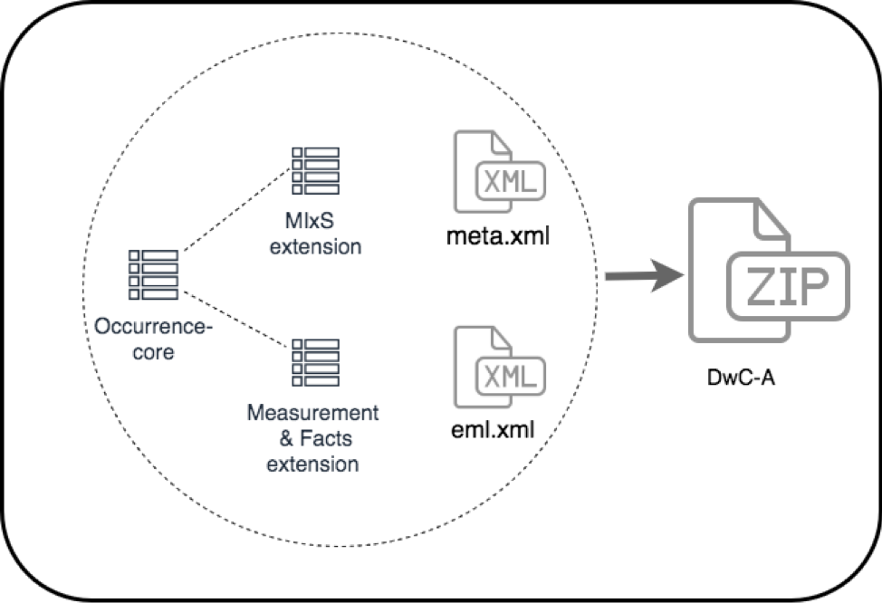
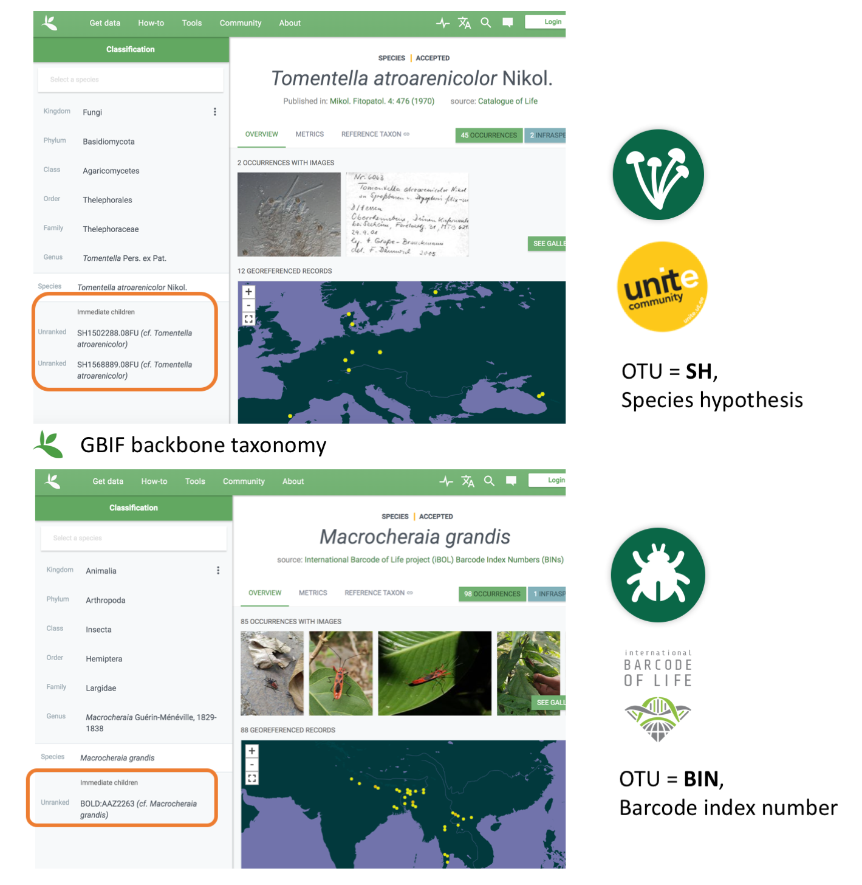

== Data packaging and mapping

This chapter focuses on practical details on turning your data export into a dataset indexed by a biodiversity data platform. <<#,Section 3.1>> will help you understand what is the optimal mapping schema for your data at hand. <<#,Section 3.2>> describes these mappings in detail.

This guide combines the standards for general biodiversity data publishing with genetic DNA-derived biodiversity data (<<figure-05,Figure 5>>). This “do-section” stops at providing mapping recommendations for different types of DNA-derived data.

Data packaging and publishing pathways vary from platform to platform and are described in general documentation. One of the widespread ways to package data files is DwC-A, where data tables are arranged in a star schema, with records (rows) in peripheral extension files pointing to a single record in the central core file (<<figure-05,Figure 5>>). The different types of core files (e.g. occurrence and sampling-event) correspond to different classes of datasets. Although DNA-derived datasets often are event-based in nature, i.e. hundreds or even thousands of quantified sequence occurrences may derive from a single sampling event and thus share most metadata attributes., The current recommendation is to publish data as Occurrence core (Category I or II) with the DNA derived data extension. This approach compensates for limitations of the DwC star schema, which would not allow any occurrence-level data in extension files (such as processed barcode sequences) to point to records in an event core file. We do, however, recommend including an eventID for each core record, to indicate the association between occurrences derived from the same sampling event.

[[figure-05]]
.Zoom in of DwC-A / IPT from figure ? in chapter 2.4. The choice of core entity is mainly a matter of fitting data to the data import mechanism (ingestion) of the biodiversity data platforms. Most data could be formulated as either Occurrence, Event or Taxon core, but as only the core can have extensions, this will affect the choice. It is for example not possible to extend occurrences with DNA sequences if data are packaged using Event core.

=== Categorization of your data

For the purpose of this guide, we categorize data into five categories, linked by a key ID field (_eventID_), equivalent to the standards for general biodiversity data, and include fields relevant for DNA-derived data (see <<data-mapping,§2.2 Data mapping>>). These five categories seek to reflect the most commonly used molecular approaches to biodiversity characterization and are I) DNA-derived occurrences, II) enriched occurrences, III) targeted species detection, IV) name references and V) metadata only. Examine the decision tree and proceed to the correct section below.

[[decision-tree]]
.A decision tree for DNA-derived data categorization.
[cols="4*^.<1a,^.<2a",stripes=none,grid=cols,frame=all]
|===
5+|
icon:question-circle[] _Is your data (meta)barcoding or qPCR based?_

4+|(Meta)barcoding +
↓
|qPCR +
↓

4+|icon:question-circle[] _Does data consist of digitized genetic material, or sequences, associated with location and time?_
|*<<category-iii-targeted-species-detection-qpcr,Category III>>* +
Targeted species detection

2+|Yes +
↓
2+|No +
↓
|

2+.^|icon:question-circle[] _Is the genetic material the *only* evidence of a given organism or community?_
2+.^|icon:question-circle[] _Is the dataset a list of DNA-based names?_
|

|Yes +
↓
|No +
↓
|Yes +
↓
|No +
↓
|

.<|*<<category-i-dna-derived-occurrences,Category I>>* +
DNA-based occurrences
.<|*<<category-ii-enriched-occurrences,Category II>>* +
Enriched occurrences
.<|*<<category-iv-name-references,Category IV>>* +
Name references
.<|*<<category-v-metadata-only-datasets,Category V>>* +
Metadata-only
|
|===

[[figure-07]]
.Visual representation of categories I-V.
image::img/web/eDNA_categories.svg[]

==== Category I: DNA-derived occurrences

This category concerns data where a DNA sequence or detection through PCR is the only evidence for the presence of a given organism or community. In other words, the data cannot be traced back to an observable specimen. This is the case for many metagenomics, metabarcoding and eDNA studies.

===== Examples of DNA-derived occurrence datasets

* MGnify (2019) Impact of rainforest transformation on phylogenetic and functional diversity of soil prokaryotic communities in Sumatra (Indonesia). Sampling event dataset https://doi.org/10.15468/osp7hi accessed via GBIF.org on 2020-04-16.
* MGnify (2020) Marine metagenomes from the bioGEOTRACES project. Sampling event dataset https://doi.org/10.15468/oifcho accessed via GBIF.org on 2020-04-16.
* Bessey C, Jarman SN, Berry O et al. (2020) Maximizing fish detection with eDNA metabarcoding. Environmental DNA: 1–12. https://doi.org/10.1002/edn3.74 (Atlas of Living Australia website at https://collections.ala.org.au/public/show/dr14581. Accessed 24 June 2020)

For guidance on how to format and share these datasets, see <<mapping-metabarcoding-edna-and-barcoding-data,§2.2.1>>. General guidelines for Darwin Core occurrence datasets are also available through the https://github.com/gbif/ipt/wiki/occurrenceData#templates[DwC-A template for occurrence datasets] and https://www.gbif.org/data-quality-requirements-occurrences[Data quality requirements for occurrences].

==== Category II: Enriched occurrences

If some genetic material is, or can be, associated with an observation or a specimen, we will categorize this type of data as “enriched occurrences”. In this context, the sequences are not the only evidence of occurrences. One can always trace the information back to a vouchered specimen or observed organism. This category includes barcoding datasets and some DNA metabarcoding datasets with reference material for example.

===== Examples of Enriched occurrence datasets

* The International Barcode of Life Consortium (2016) International Barcode of Life project (iBOL). Occurrence dataset https://doi.org/10.15468/inygc6 accessed via GBIF.org on 2020-04-16.
* Takamura K (2019) Chironomid Specimen records in the Chironomid DNA Barcode Database. Version 1.9. National Institute of Genetics, ROIS. Occurrence dataset https://doi.org/10.15468/hxhow5 accessed via GBIF.org on 2020-04-16.
* Bessey C, Jarman SN, Stat M, Rohner CA, Bunce M, Koziol A, Power M, Rambahiniarison JM, Ponzo A, Richardson AJ & Berry O (2019) DNA metabarcoding assays reveal a diverse prey assemblage for Mobula rays in the Bohol Sea, Philippines. Ecology and Evolution 9 (5) 2459-2474. https://doi.org/10.1002/ece3.4858, (Atlas of Living Australia website at https://collections.ala.org.au/public/show/dr11663. Accessed 24 June 2020)

For guidance on how to format and share these datasets, see <<mapping-metabarcoding-edna-and-barcoding-data,§2.2.1>>. General guidelines for Darwin Core occurrence datasets are also available through the https://github.com/gbif/ipt/wiki/occurrenceData#templates[DwC-A template for occurrence datasets] and https://www.gbif.org/data-quality-requirements-occurrences{Data quality requirements for occurrences].

==== Category III: Targeted species detection (qPCR/ddPCR)

This category concerns data where a specific ( qPCR/ddPCR) assay is used to detect the presence (or absence) of a DNA sequence specific to the target organism in an environmental sample. In this case the occurrence record may not even contain sequence data, as it is the process itself that determines the occurrence. With qPCR/ddPCR analyses for targeted species detection, many studies also report absence of that specific species for a given sample. Absence data is highly dependent on the detection limit of the specific assay, as well as field and lab protocols. As for DNA-metabarcoding data there is an issue of both false negatives and false positives, and it is important that sufficient information is reported for evaluating the records.

===== Examples of targeted species occurrence datasets
* Strzelecki, Joanna; Feng, Ming; Berry, Olly; Zhong, Liejun; Keesing, John; Fairclough, David; Pearce, Alan; Slawinski, Dirk; Mortimer, Nick. Location and transport of early life stages of Western Australian Dhufish Glaucosoma hebraicum. Floreat, WA: Fisheries Research and Development Corporation; 2013. http://hdl.handle.net/102.100.100/97533?index=1 (Atlas of Living Australia website at https://collections.ala.org.au/public/show/dr8131. Accessed 22 July 2020)

For guidance on how to format and share these datasets, see <<mapping-ddpcr-qpcr-data,§2.2.2>>. General guidelines for Darwin Core occurrence datasets are also available through the https://github.com/gbif/ipt/wiki/occurrenceData#templates[DwC-A template for occurrence datasets] and https://www.gbif.org/data-quality-requirements-occurrences[Data quality requirements for occurrences].

==== Category IV: Name references

This category corresponds to DNA-derived names, derived from clustering or denoising (error-correction based models), such as stable non-Linnaean Operational Taxonomic Units (OTU), Amplicon Sequence Variant (ASV) and Barcode Index Numbers (BIN)—in other words, any reference to taxa or provisional names that are defined outside of the Linnaean taxonomy. Numerous projects produce local project- or study-specific libraries of OTUs, and although it is technically possible to publish these as checklists, they have limited to no value for data linking or interpretation; as a result, we do not encourage their publication through biodiversity data platforms. However, the inclusion of the widely adopted, stable, global, digitally referenceable OTUs into Linnaean taxonomic backbones is critically important for indexing unnamed “dark” biodiversity. GBIF have accumulated experience in integrating such large and global reference libraries of OTUs into the GBIF taxonomic backbone, which allows the display of OTUs under the nearest parent taxon which has a Latin name (<<figure-06,Figure 6>>). 

[[figure-06]]
.OTUs from UNITE (fungi, above) and from BOLD (arthropods, below) are displayed in the GBIF backbone taxonomy under their corresponding parent taxa which have Latin names. Multiple individually observed occurrences of cryptic biodiversity become discoverable together with non-genetic evidence through a single access point.

===== Examples of Name references checklists

*	The International Barcode of Life Consortium (2016). International Barcode of Life project (iBOL) Barcode Index Numbers (BINs). Checklist dataset https://doi.org/10.15468/wvfqoi accessed via GBIF.org on 2020-04-16.
*	PlutoF (2019). UNITE - Unified system for the DNA based fungal species linked to the classification. Version 1.2. Checklist dataset https://doi.org/10.15468/mkpcy3 accessed via GBIF.org on 2020-04-16.

This guide does not provide mapping recommendations for global OTU checklists / reference libraries (Category IV), and publishing referenceable (project- or study-specific) OTU libraries as checklists is discouraged. For guidance on how to format and share OTU checklists, see the following general Darwin Core guidelines in https://github.com/gbif/ipt/wiki/checklistData#templates[DwC-A template for checklists] and https://www.gbif.org/data-quality-requirements-checklists[Data quality requirements for checklists]. https://www.ebi.ac.uk/ena/submit/mixs-checklists[General guidelines for MIxS checklists]. For advice on how to map global reference libraries of OTUs for inclusion in the GBIF taxonomic backbone, contact the mailto:helpdesk@gbif.org[GBIF help desk].

==== Category V: Metadata-only datasets

Metadata are data about the data and is a description of the dataset in broad terms, such as authors, author affiliations, original research purpose of the dataset, DOI(s), taxonomic scope, temporal scope, and geographical scope. Information regarding laboratory methods and general sequencing methods is included in this category. This category includes datasets or collections that cannot be made available online at the moment, e.g. undigitized work.

===== Examples of Metadata-only datasets

*	Collins E, Sweetlove M (2019). Arctic Ocean microbial metagenomes sampled aboard CGC Healy during the 2015 GEOTRACES Arctic research cruise. SCAR - Microbial Antarctic Resource System. Metadata dataset https://doi.org/10.15468/iljmun accessed via GBIF.org on 2020-04-16.
*	Cary S C (2015). New Zealand Terrestrial Biocomplexity Survey. SCAR - Microbial Antarctic Resource System. Metadata dataset https://doi.org/10.15468/xnzrhq accessed via GBIF.org on 2020-04-16.

Mapping recommendations for metadata-only DNA-derived datasets (Category V) is the same as for any other metadata-only datasets, and this guide does not provide any specific mapping recommendations for metadata. Please follow general recommendations of biodiversity data portals, paying attention to https://github.com/gbif/ipt/wiki/resourceMetadata[required and recommended metadata]. Descriptions of field, lab, and bioinformatics steps should be as detailed as possible. Describing your methods as method steps in the EML metadata makes them display on the dataset homepage in GBIF (example). However, if a structured and possibly more detailed method description is already published somewhere (e.g. at https://protocols.io[protocols.io]), it is straightforward to provide a link through the MIxS SOP field (see <<mapping-metabarcoding-edna-and-barcoding-data,§2.2.1>>).

=== Data mapping

While core files store ubiquitous data on the 'what, where and when' of a record, extension files are used to describe the specifics of a certain type of observation. We propose using the http://rs.gbif.org/sandbox/extension/dna_derived_data_2021-05-14.xml[DNA derived data extension] to complement occurrence data derived from either barcoding, metabarcoding (eDNA) or qPCR/ddPCR. The DNA derived data extension builds on the https://gensc.org/mixs/[Minimum information standards] developed by the Genomic Standards Consortium (GSC) and applied by the https://www.ebi.ac.uk/ena/browser/home[ENA] for https://www.ebi.ac.uk/ena/submit/mixs-checklists[submission of eDNA sample metadata], for example. We are following and have contributed to the guidelines proposed by the https://github.com/tdwg/gbwg/tree/main/dwc-mixs[Sustainable DwC-MIxS interoperability task group under TDWG]. To improve indexing and search we have opted to split some MIxS terms, for instance separating forward and reverse primer sequences and names. Furthermore, some fields from the GGBN standard and fields from the MIQE  (minimum information for the publication of quantitative real-time PCR) guidelines for qPCR and ddPCR data have been included to make it applicable for a wide range of DNA-derived data.

As a first step in preparing your data for publishing, you should make sure your field names / column headers follow the https://dwc.tdwg.org/terms/[Darwin Core data standard]. In many cases this is straightforward, such as renaming your `lat` or `latitude` field to `decimalLatitude`. However, the Darwin Core Standard is quite flexible and some terms are used in different ways, depending on the type of data. An example of this are the fields term:dwc[organismQuantity] and term:dwc[organismQuantityType], which could be used to describe the number of individuals, per cent biomass or a score on the Braun-Blanquet Scale, as well as the number of reads of an ASV within a sample. Therefore, we here provide tables of required and recommended fields with descriptions and examples (<<table-01,Table 1>>, <<table-02,Table 2>>, <<table-03,Table 3>> and <<table-04, Table 4>>). Additional fields and extensions (such as http://rs.gbif.org/extension/obis/extended_measurement_or_fact.xml[extended Measurement or Fact (eMoF)]) are applicable. When a sequence is derived from an organism (e.g. a parasite, gut contents, epibiont etc) the observation may be linked to the observation of the host organism. This can be achieved using the (https://dwc.tdwg.org/terms/#resourcerelationship[Resource Relation extension^]) of Darwin Core (e.g. https://www.gbif.org/species/143610775/verbatim). Perhaps the most important recommendation is to use globally unique (when available) and other permanent identifiers for as many data fields and parameters as possible (in all ID fields in the tables below).

[.landscape]
<<<

==== Mapping metabarcoding (eDNA) and barcoding data

This section provides mapping recommendations for Categories I and II.

[[table-01]]
.Recommended fields for http://rs.gbif.org/core/dwc_occurrence_2020-04-15.xml[Occurrence core] for Metabarcoding data
[cols="1,1,4,1",options="header"]
|===
| Field name
| Examples
| Description
| Required

| term:dwc[basisOfRecord]
| MaterialSample
| The specific nature of the data record - a subtype of the http://rs.gbif.org/vocabulary/dwc/basis_of_record.xml[dcterms:type]. For DNA-derived occurrences, (see <<category-i-dna-derived-occurrences,Category I>> and <<category-iii-targeted-species-detection-qpcr,Category III>>) use MaterialSample. For enriched occurrences use PreservedSpecimen or LivingSpecimen as appropriate.
| Required

| term:dwc[eventID]
| urn:uuid:a964765b-22c4-439a-jkgt-2
| An identifier for the set of information associated with an Event (something that occurs at a place and time). May be a global unique identifier or an identifier specific to the data set
| Highly recommended

| term:dwc[eventDate]
| 2020-01-05
| 
| Required

| term:dwc[recordedBy]
| "Oliver P. Pearson \| Anita K. Pearson"
| A list (concatenated and separated) of names of people, groups, or organizations responsible for recording the original Occurrence. The recommended best practice is to separate the values with a vertical bar (' \| '). Including information about the observer improves the scientific reproducibility (https://doi.org/10.1093/database/baaa072[Groom et al. 2020^]).
| Highly recommended

| term:dwc[organismQuantity]
| 33
| Number of reads of this sequence variant in the sample
| Highly recommended

| term:dwc[organismQuantityType]
| DNA sequence reads
| Should always be “DNA sequence reads”
| Highly recommended

| term:dwc[sampleSizeValue]
| 1233890
| Total number of reads in the sample. This is important since it allows calculating the relative abundance of the sequence variant within the sample.
| Highly recommended

| term:dwc[sampleSizeUnit]
| DNA sequence reads
| Should always be “DNA sequence reads”
| Highly recommended

| term:dwc[materialSampleID]
| https://www.ncbi.nlm.nih.gov/biosample/15224856 +
 +
https://www.ebi.ac.uk/ena/browser/view/SAMEA3724543 +
 +
urn:uuid:a964805b-33c2-439a-beaa-6379ebbfcd03
| An identifier for the MaterialSample (as opposed to a particular digital record of the material sample). Use the biosample ID if one was obtained from a nucleotide archive. In the absence of a persistent global unique identifier, construct one from a combination of identifiers in the record that will most closely make the materialSampleID globally unique.
| Highly recommended

| term:dwc[samplingProtocol]
| 
| 
| 

| term:dwc[associatedSequences]
| https://www.ncbi.nlm.nih.gov/nuccore/MK405371
| A list (concatenated and separated) of identifiers (publication, global unique identifier, URI) of genetic sequence information associated with the Occurrence. Could be used for linking to archived raw barcode reads and/or associated genome sequences, e.g. in a public repository.
| Recommended

| term:dwc[identificationRemarks]
| RDP annotation confidence (at lowest specified taxon): 0.96, against reference database: GTDB
| Specification of taxonomic identification process, ideally including data on applied algorithm and reference database, as well as on level of confidence in the resulting identification.
| Recommended

| term:dwc[identificationReferences]
| https://www.ebi.ac.uk/metagenomics/pipelines/4.1 + 
 +
https://github.com/terrimporter/CO1Classifier
| 
| Recommended

| term:dwc[decimalLatitude]
| 60.545207
| 
| Highly recommended

| term:dwc[decimalLongitude]
| 24.174556
| 
| Highly recommended

// The [.break-all]#ASV:…# is to allow the identifier to be broken at any character, rather than stretching the text cell.
| term:dwc[taxonID]
| [.break-all]#ASV:7bdb57487bee022ba30c03c3e7ca50e1#
| For eDNA data, it is recommended to use an MD5 hash of the sequence and prepend it with “ASV:”. See also <<taxonomy-of-sequences,§1.6>>.
| Highly recommended, if DNA_sequence is not provided 

| term:dwc[scientificName]
| Gadus morhua L. 1758, BOLD:ACF1143
| Latin name of the closest known taxon (species or higher) or an OTU identifier from BOLD or UNITE
| Required

| term:dwc[kingdom]
| Animalia
| 
| Highly recommended

| term:dwc[phylum]
| Chordata
| 
| Recommended

| term:dwc[class]
| Actinopterygii
| 
| Recommended

| term:dwc[order]
| Gadiformes
| 
| Recommended

| term:dwc[family]
| Gadidae
| 
| Recommended

| term:dwc[genus]
| Gadus
| 
| Recommended
|===

[[table-02]]
.Recommended fields from the DNA derived data extension (a selection) for metabarcoding data
[cols="1,1,4,1",options="header"]
|===
| Field name
| Examples
| Description
| Required

// The [.break-all]#TCTA…# is to allow the sequence to be broken at any character, rather than stretching the text cell.
| term:mixs[DNA_sequence]
| [.break-all]#TCTATCCTCAATTATAGGTCATAATTCACCATCAGTAGATTTAGGAATTTTCTCTATTCATATTGCAGGTGTATCATCAATTATAGGATCAATTAATTTTATTGTAACAATTTTAAATATACATACAAAAACTCATTCATTAAACTTTTTACCATTATTTTCATGATCAGTTCTAGTTACAGCAATTCTCCTTTTATTATCATTA#
| The DNA sequence (ASV). Taxonomic interpretation of the sequence depends on the technology and reference library available at the time of publication. Hence, the most objective taxonomic handle is the sequence which can be reinterpreted in the future.
| Highly recommended

| term:mixs[sop]
| https://www.protocols.io/view/emp-its-illumina-amplicon-protocol-pa7dihn
| Standard operating procedures used in assembly and/or annotation of genomes, metagenomes or environmental sequences. +
 +
A reference to a well documented protocol, e.g. using https://protocols.io[protocols.io]
| Recommended

| term:mixs[target_gene]
| 16S rRNA, 18S rRNA, nif, amoA, rpo
| Targeted gene or marker name for marker-based studies
| Highly recommended

| term:mixs[target_subfragment]
| V6, V9, ITS
| Name of subfragment of a gene or markerImportant to e.g. identify special regions on marker genes like the hypervariable V6 region of the 16S rRNA gene
| Highly recommended

| term:mixs[pcr_primer_forward]
| GGACTACHVGGGTWTCTAAT
| Forward PCR primer that was used to amplify the sequence of the targeted gene, locus or subfragment.
| Highly recommended

| term:mixs[pcr_primer_reverse]
| GGACTACHVGGGTWTCTAAT
| Reverse PCR primer that was used to amplify the sequence of the targeted gene, locus or subfragment.
| Highly recommended

| term:mixs[pcr_primer_name_forward]
| jgLCO1490
| Name of the forward PCR primer
| Highly recommended

| term:mixs[pcr_primer_name_reverse]
| jgHCO2198
| Name of the reverse PCR primer
| Highly recommended

| term:mixs[pcr_primer_reference]
| https://doi.org/10.1186/1742-9994-10-34
| Reference for the primers
| Highly recommended

| term:mixs[env_broad_scale]
| forest biome [ENVO:01000174]
| *Equivalent to env_biome in MIxS v4* +
In this field, report which major environmental system your sample or specimen came from. The systems identified should have a coarse spatial grain, to provide the general environmental context of where the sampling was done (e.g. were you in the desert or a rainforest?). We recommend using subclasses of ENVO´s biome class: +
http://purl.obolibrary.org/obo/ENVO_00000428
| Recommended

| term:mixs[env_local_scale]
| litter layer [ENVO:01000338]
| *Equivalent to env_feature in MIxS v4* +
In this field, report the entity or entities which are in your sample or specimen´s local vicinity and which you believe have significant causal influences on your sample or specimen. Please use terms that are present in ENVO and which are of smaller spatial grain than your entry for env_broad_scale.
| Recommended

| term:mixs[env_medium]
| soil[ENVO:00001998]
| *Equivalent to env_material in MIxS v4* +
In this field, report which environmental material or materials (pipe separated) immediately surrounded your sample or specimen prior to sampling, using one or more subclasses of ENVO´s environmental material class: + http://purl.obolibrary.org/obo/ENVO_00010483
| Recommended

| term:mixs[lib_layout]
| Paired
| *Equivalent to lib_const_meth in MIxS v4* +
Specify whether to expect single, paired, or other configuration of reads
| Recommended

| term:mixs[seq_meth]
| Illumina HiSeq 1500
| Sequencing method used; e.g. Sanger, pyrosequencing, ABI-solid
| Highly recommended

| term:mixs[votu_class_appr]
| "95% ANI;85% AF; greedy incremental clustering"
| Cutoffs and approach used when clustering new UViGs in "species-level" vOTUs. Note that results from standard 95% ANI / 85% AF clustering should be provided alongside vOTUS defined from another set of thresholds, even if the latter are the ones primarily used during the analysis
| Highly recommended

| term:mixs[votu_seq_comp_appr]
| "blastn;2.6.0+;e-value cutoff: 0.001"
| Tool and thresholds used to compare sequences when computing "species-level" vOTUs
| Highly recommended

| term:mixs[votu_db]
| "NCBI Viral RefSeq;83", "UNITE;8.2"
| Reference database (i.e. sequences not generated as part of the current study) used to cluster new genomes in species-level" vOTUs, if any
| Highly recommended
|===

==== Mapping ddPCR / qPCR data

This section provides mapping recommendations for https://academic.oup.com/view-large/199871507[Category III].

[[table-03]]
.Recommended fields for Occurrence core for ddPCR/qPCR data
[cols="1,1,4,1",options="header"]
|===
| Field name
| Examples
| Description
| Required

| term:dwc[basisOfRecord]
| MaterialSample
| The specific nature of the data record - a subtype of the dcterms:type. For DNA-derived occurrences (see <<category-i-dna-derived-occurrences,Category I>> and <<category-iii-targeted-species-detection-qpcr,Category III>>), use MaterialSample.
| Required

| term:dwc[occurrenceStatus]
| Present, Absent
| A statement about the presence or absence of a taxon at a location.
| Required

| term:dwc[eventID]
| urn:uuid:a964765b-22c4-439a-jkgt-2
| An identifier for the set of information associated with an Event (something that occurs at a place and time). May be a global unique identifier or an identifier specific to the dataset.
| Highly recommended

| term:dwc[eventDate]
| 2020-01-05
| 
| Required

| term:dwc[recordedBy]
| "Oliver P. Pearson \| Anita K. Pearson"
| A list (concatenated and separated) of names of people, groups, or organizations responsible for recording the original Occurrence. The recommended best practice is to separate the values with a vertical bar (' \| '). Including information about the observer improves the scientific reproducibility (https://doi.org/10.1093/database/baaa072[Groom et al. 2020^]).
| Highly recommended

| term:dwc[organismQuantity]
| 50
| Number of positive droplets/chambers in the sample
| Highly recommended for ddPCR, dPCR

| term:dwc[organismQuantityType]
| ddPCR droplets +
dPCR chambers
| The partition type 
| Highly recommended for ddPCR, dPCR

| term:dwc[sampleSizeValue]
| 20000
| The number of accepted partitions (n), e.g. meaning accepted droplets in ddPCR or chambers in dPCR.
| Highly recommended for ddPCR, dPCR

| term:dwc[sampleSizeUnit]
| ddPCR droplets +
dPCR chambers
| The partition type, should be equal to the value in organismQuantityType	
| Highly recommended for ddPCR, dPCR

| term:dwc[materialSampleID]
| https://www.ncbi.nlm.nih.gov/biosample/15224856 +
 +
urn:uuid:a964805b-33c2-439a-beaa-6379ebbfcd03
| An identifier for the MaterialSample (as opposed to a particular digital record of the material sample). Use the biosample ID if one was obtained from a nucleotide archive. In the absence of a persistent global unique identifier, construct one from a combination of identifiers in the record that will most closely make the materialSampleID globally unique.	
| Highly recommended

| term:dwc[samplingProtocol]
| 
| 
| 

| term:dwc[decimalLatitude]
| 60.545207
| 
| Highly recommended

| term:dwc[decimalLongitude]
| 24.174556
| 
| Highly recommended

| term:dwc[scientificName]
| Gadus morhua L. 1758, BOLD:ACF1143
| Latin name of the closest known taxon (species or higher) or an OTU identifier from BOLD or UNITE
| Required

| term:dwc[kingdom]
| Animalia
| 
| Highly recommended

| term:dwc[phylum]
| Chordata
| 
| Recommended

| term:dwc[class]
| Actinopterygii
| 
| Recommended

| term:dwc[order]
| Gadiformes
| 
| Recommended

| term:dwc[family]
| Gadidae
| 
| Recommended

| term:dwc[genus]
| Gadus
| 
| Recommended
|===

[[table-04]]
.Recommended fields from the http://rs.gbif.org/sandbox/extension/dna_derived_data_2021-05-14.xml[DNA derived data extension] (a selection) for ddPCR/qPCR data
[cols="1,1,4,1",options="header"]
|===
| Field name
| Examples
| Description
| Required

| term:mixs[sop]
| https://www.protocols.io/view/protocol-for-dna-extraction-and-quantitative-pcr-d-vwie7ce +
 +
https://doi.org/10.17504/protocols.io.vwie7ce
| Standard operating procedures used in assembly and/or annotation of genomes, metagenomes or environmental sequences. +
A reference to a well documented protocol, e.g. using https://protocols.io[protocols.io]
| Highly recommended

| term:mixs[annealingTemp]
| 60
| The reaction temperature during the annealing phase of PCR.
| Required if annealingTemp was supplied

| term:mixs[annealingTempUnit]
| Degrees Celsius
| 
| Highly recommended

| term:mixs[pcr_cond]
| initial denaturation:94_3;annealing:50_1;elongation:72_1.5;final elongation:72_10;35
| Description of reaction conditions and components of PCR in the form of "initial denaturation:94degC_1.5min; annealing=..."
| Highly recommended

| term:mixs[probeReporter]
| FAM
| Type of fluorophore (reporter) used. Probe anneals within amplified target DNA. Polymerase activity degrades the probe that has annealed to the template, and the probe releases the fluorophore from it and breaks the proximity to the quencher, thus allowing fluorescence of the fluorophore.
| Highly recommended

| term:mixs[probeQuencher]
| NFQ-MGB
| Type of quencher used. The quencher molecule quenches the fluorescence emitted by the fluorophore when excited by the cycler’s light source as long as fluorophore and the quencher are in proximity, quenching inhibits any fluorescence signals.
| Highly recommended

| term:mixs[ampliconSize]
| 83
| The length of the amplicon in basepairs
| Highly recommended

| term:mixs[thresholdQuantificationCycle]
| 0.3
| Threshold for change in fluorescence signal between cycles
| qPCR: Highly recommended

| term:mixs[baselineValue]
| 15
| The number of cycles when fluorescence signal from the target amplification is below background fluorescence not originated from the real target amplification.
| qPCR: Highly recommended

| term:mixs[quantificationCycle]
| 37.9450950622558
| The number of cycles required for the fluorescent signal to cross a given value threshold above the baseline. Quantification cycle (Cq), threshold cycle (Ct), crossing point (Cp), and take-off point (TOP) refer to the same value from the real-time instrument. Use of quantification cycle (Cq), is preferable according to the http://www.rdml.org[RDML (Real-Time PCR Data Markup Language) data standard]
| 

| term:mixs[automaticThresholdQuantificationCycle]
| no
| Whether the threshold was set by instrument or manually
| 

| term:mixs[automaticBaselineValue]
| no
| Whether baseline value was set by instrument or manually
| 

| term:mixs[contaminationAssessment]
| no
| Whether DNA or RNA contamination assessment was done or not
| 

| term:mixs[estimatedNumberOfCopies]
| 10300
| Number of target molecules per µl. Mean copies per partition (?) can be calculated using the number of partitions (n) and the estimated copy number in the total volume of all partitions (m) with a formula ?=m/n.
| 

| term:mixs[amplificationReactionVolume]
| 22
| PCR reaction volume
| 

| term:mixs[amplificationReactionVolumeUnit]
| µl
| Unit used for PCR reaction volume. Many of the instruments require preparation of a much larger initial sample volume than is actually analysed.
| 

| term:mixs[pcr_analysis_software]
| BIO-RAD QuantaSoft
| The program used to analyse the d(d)PCR runs.
| 

| term:mixs[experimentalVariance]
|
| Multiple biological replicates are encouraged to assess total experimental variation. When single dPCR experiments are performed, a minimal estimate of variance due to counting error alone must be calculated from the binomial (or suitable equivalent) distribution.
| 

| term:mixs[target_gene]
| 16S rRNA, 18S rRNA, nif, amoA, rpo
| Targeted gene or marker name for marker-based studies
| Highly recommended

| term:mixs[target_subfragment]
| V6, V9, ITS
| Name of subfragment of a gene or markerImportant to identify, for example, special regions on marker genes like the hypervariable V6 region of the 16S rRNA gene
| Highly recommended

| term:mixs[pcr_primer_forward]
| GGACTACHVGGGTWTCTAAT
| Forward PCR primer that was used to amplify the sequence of the targeted gene, locus or subfragment.
| Highly recommended

| term:mixs[pcr_primer_reverse]
| GGACTACHVGGGTWTCTAAT
| Reverse PCR primer that was used to amplify the sequence of the targeted gene, locus or subfragment.
| Highly recommended

| term:mixs[pcr_primer_name_forward]
| jgLCO1490
| Name of the forward PCR primer 
| Highly recommended

| term:mixs[pcr_primer_name_reverse]
| jgHCO2198
| Name of the reverse PCR primer 
| Highly recommended

| term:mixs[pcr_primer_reference]
| https://doi.org/10.1186/1742-9994-10-34
| Reference for the primers
| Highly recommended

| term:mixs[env_broad_scale]
| forest biome [ENVO:01000174]
| *Equivalent to env_biome in MIxS v4* + 
In this field, report which major environmental system your sample or specimen came from. The systems identified should have a coarse spatial grain, to provide the general environmental context of where the sampling was done (e.g. were you in the desert or a rainforest?). We recommend using subclasses of ENVO´s biome class: +
http://purl.obolibrary.org/obo/ENVO_00000428
| Recommended

| term:mixs[env_local_scale	]
| litter layer [ENVO:01000338]
| *Equivalent to env_feature in MIxS v4* +
In this field, report the entity or entities which are in your sample or specimen´s local vicinity and which you believe have significant causal influences on your sample or specimen. Please use terms that are present in ENVO and which are of smaller spatial grain than your entry for env_broad_scale.
| Recommended

| term:mixs[env_medium]
| soil [ENVO:00001998]
| *Equivalent to env_material in MIxS v4* +
In this field, report which environmental material or materials (pipe separated) immediately surrounded your sample or specimen prior to sampling, using one or more subclasses of ENVO´s environmental material class: +
http://purl.obolibrary.org/obo/ENVO_00010483
| Recommended

| term:mixs[concentration]
| 67.5
| Concentration of DNA (weight ng/volume µl) see also http://terms.tdwg.org/wiki/ggbn:concentration
| Recommended

| term:mixs[concentrationUnit]
| ng/µl
| Unit used for concentration measurement see also http://terms.tdwg.org/wiki/ggbn:concentrationUnit
| Recommended

| term:mixs[methodDeterminationConcentrationAndRatios]
| Nanodrop, Qubit
| Description of method used for concentration measurement see also http://terms.tdwg.org/wiki/ggbn:methodDeterminationConcentrationAndRatios
| Recommended	

| term:mixs[ratioOfAbsorbance260_230]
| 1.89
| Ratio of absorbance at 260 nm and 230 nm assessing DNA purity (mostly secondary measure, indicates mainly EDTA, carbohydrates, phenol), (DNA samples only). see also http://terms.tdwg.org/wiki/ggbn:ratioOfAbsorbance260_230
| Recommended

| term:mixs[ratioOfAbsorbance260_280]
| 1.91
| Ratio of absorbance at 280 nm and 230 nm assessing DNA purity (mostly secondary measure, indicates mainly EDTA, carbohydrates, phenol), (DNA samples only). see also http://terms.tdwg.org/wiki/ggbn:ratioOfAbsorbance260_280
| Recommended

| term:mixs[samp_collect_device]
| biopsy, niskin bottle, push core
| The method or device employed for collecting the sample
| Recommended

| term:mixs[samp_mat_process]
| filtering of seawater, storing samples in ethanol
| Any processing applied to the sample during or after retrieving the sample from environment. This field accepts OBI, for a browser of OBI (v 2018-02-12) terms please see http://purl.bioontology.org/ontology/OBI
| Recommended

| term:mixs[samp_size]
| 5 litre
| Amount or size of sample (volume, mass or area) that was collected
| Recommended

| term:mixs[size_frac]
| 0-0.22 micrometer
| Filtering pore size used in sample preparation
| Recommended

| term:mixs[pcr_primer_lod]
| 51
| The assay's ability to detect the target at low levels
| Highly recommended

| term:mixs[pcr_primer_loq]
| 184
| The assay's ability to quantify copy number at low levels
| Highly recommended
| 
|===

[.portrait]
<<<
