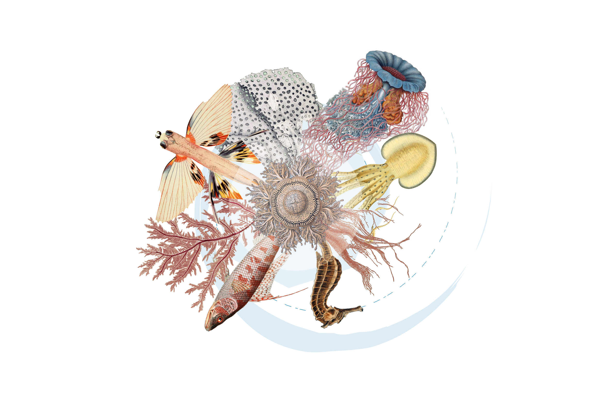

// add cover image to img directory and update filename below
ifdef::backend-html5[]

endif::backend-html5[]

== Colophon

=== Suggested citation

Abarenkov K, Andersson AF, Bissett A, Finstad AG, Fossøy F, Grosjean M, Hope M, Jeppesen TS, Kõljalg U, Lundin D, Nilsson RN, Prager M, Schigel D, Suominen S, Svenningsen C & Frøslev TG (2023) Publishing DNA-derived data through biodiversity data platforms. v1.3 Copenhagen: GBIF Secretariat. https://doi.org/10.35035/doc-vf1a-nr22.

=== Authors

* https://orcid.org/0000-0001-5526-4845[Kessy Abarenkov], mailto:kessy.abarenkov@ut.ee[kessy.abarenkov@ut.ee], Natural History Museum and Botanical Garden, University of Tartu, 46 Vanemuise Street, 51003 Tartu, Estonia
* https://orcid.org/0000-0002-3627-6899[Anders F. Andersson], mailto:anders.andersson@scilifelab.se[anders.andersson@scilifelab.se], Science for Life Laboratory, Department of Gene Technology, KTH Royal Institute of Technology, 17121 Stockholm, Sweden
* https://orcid.org/0000-0001-7396-1484[Andrew Bissett], mailto:Andrew.Bissett@csiro.au[Andrew.Bissett@csiro.au], CSIRO O&A, GPO box 1533, Hobart, Tasmania, 7000, Australia
* https://orcid.org/0000-0003-4529-6266[Anders G. Finstad], mailto:anders.finstad@ntnu.no[anders.finstad@ntnu.no], Department of Natural History, Centre for Biodiversity Dynamics, Norwegian University of Science and Technology, Trondheim, Norway
* https://orcid.org/0000-0002-7535-9574[Frode Fossøy], mailto:Frode.Fossoy@nina.no[Frode.Fossoy@nina.no], Centre for Biodiversity Genetics (NINAGEN), Norwegian institute for nature research (NINA), P.O. Box 5685 Torgarden, NO-7485 Trondheim, Norway
* https://orcid.org/0000-0002-2685-8078[Marie Grosjean], mailto:mgrosjean@gbif.org[mgrosjean@gbif.org], Global Biodiversity Information Facility, Universitetsparken 15, 2100 København Ø, Denmark
* https://orcid.org/0000-0002-4827-3310[Michael Hope], mailto:Michael.Hope@ga.gov.au[Michael.Hope@ga.gov.au], Atlas of Living Australia, CSIRO National Collections & Marine Infrastructure, GPO Box 1700, Canberra ACT 2601, Australia.
* https://orcid.org/0000-0003-1691-239X[Thomas S. Jeppesen], mailto:tsjeppesen@gbif.org[tsjeppesen@gbif.org], Global Biodiversity Information Facility, Universitetsparken 15, 2100 København Ø, Denmark
* https://orcid.org/0000-0002-5171-1668[Urmas Kõljalg], mailto:urmas.koljalg@ut.ee[urmas.koljalg@ut.ee], Natural History Museum and Botanical Garden, University of Tartu, 46 Vanemuise Street, 51003 Tartu, Estonia.
* https://orcid.org/0000-0002-8779-6464[Daniel Lundin], mailto:daniel.lundin@lnu.se[daniel.lundin@lnu.se], Centre for Ecology and Evolution in Microbial model Systems - EEMiS, Linnaeus University, SE-39182 Kalmar, Sweden
* https://orcid.org/0000-0002-8052-0107[R. Henrik Nilsson], mailto:henrik.nilsson@bioenv.gu.se[henrik.nilsson@bioenv.gu.se], University of Gothenburg, Department of Biological and Environmental Sciences, Box 461, 405 30 Göteborg, Sweden
* https://orcid.org/0000-0003-4897-8422[Maria Prager], mailto:maria.prager@scilifelab.se[maria.prager@scilifelab.se], Science for Life Laboratory, Department of Ecology, Environment and Plant Sciences, Stockholm University; Department of Microbiology, Tumor and Cell Biology, Karolinska Institutet
* https://orcid.org/0000-0002-4236-0384[Pieter Provoost], mailto:p.provoost@unesco.org[p.provoost@unesco.org], Ocean Biodiversity Information System, Jacobsenstraat 1, 8400 Oostende, Belgium
* https://orcid.org/0000-0002-2919-1168[Dmitry Schigel], mailto:dschigel@gbif.org[dschigel@gbif.org], Global Biodiversity Information Facility, Universitetsparken 15, 2100 København Ø, Denmark
* https://orcid.org/0000-0002-2919-1168[Saara Suominen], mailto:s.suominen@unesco.org[s.suominen@unesco.org], Ocean Biodiversity Information System, Jacobsenstraat 1, 8400 Oostende, Belgium
* https://orcid.org/0000-0002-9216-2917[Cecilie Svenningsen], mailto:csvenningsen@gbif.org[csvenningsen@gbif.org], Global Biodiversity Information Facility, Universitetsparken 15, 2100 København Ø, Denmark
* https://orcid.org/0000-0002-3530-013X[Tobias Guldberg Frøslev], mailto:tfroeslev@gbif.org[tfroeslev@gbif.org], Global Biodiversity Information Facility, Universitetsparken 15, 2100 København Ø, Denmark

=== Contributors

Valuable discussions with members of ELIXIR, iBOL, GGBN, GLOMICON, and OBIS networks contributed to compilation of this draft. We are especially grateful for inputs and encouragement from  Andrew Bentley, Matt Blissett, Pier Luigi Buttigieg, Kyle Copas, Camila A. Plata Corredor, Gabriele Dröge, Torbjørn Ekrem, Birgit Gemeinholzer, Quentin Groom, Tim Hirsch, Donald Hobern, Hamish Holewa, Corinne Martin, Raissa Meyer, Chris Mungall, Daniel Noesgaard, Corinna Paeper, Tim Robertson, Maxime Sweetlove, Andrew Young, John Waller, Ramona Walls, John Wieczorek, Lucie Zinger who have contributed to the GBIF community review process.

=== License

The document _Publishing DNA-derived data
through biodiversity data platforms_ is licensed under https://creativecommons.org/licenses/by-sa/4.0[Creative Commons Attribution-ShareAlike 4.0 Unported License].

=== Persistent URI

https://doi.org/10.35035/doc-vf1a-nr22

=== Document control

Version 1.3.0 released on XXX. This version has an added paragraph on Marine datasets and the Ocean Biodiversity Information System (OBIS), and some minor text edits throughout the document. 

=== Abstract

When genetic information is used to describe or classify a taxon, most users will foresee its use in the context of molecular ecology or phylogenetic research. It is important to realize that a sequence with coordinates and a timestamp is a valuable biodiversity occurrence which is useful in a much broader context than its original purpose. To realize this potential, DNA-derived data needs to be discoverable through biodiversity data platforms. This guide will teach you the principles and approaches of exposing “sequences with dates and coordinates” in the context of broader biodiversity data. The guide covers choices of particular schemas and terms, common pitfalls and good practice, without going into platform-specific details. It will benefit anyone interested in better exposure of DNA-derived data through general biodiversity data platforms, including national biodiversity portals.

=== Cover image

Velvet shank (_Flammulina velutipes_), Kursk, Russian Federation. Photo 2020 Oleg Ryzhkov via https://www.gbif.org/occurrence/2550027893[iNaturalist research-grade observations], licensed under http://creativecommons.org/licenses/by-nc/4.0/[CC BY-NC 4.0].
