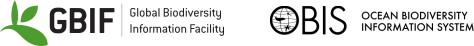

= Publishing DNA-derived data through biodiversity data platforms
:authorcount: 17
// NB: There are non-breaking spaces to avoid the author names wrapping on the title page.
:author_1: Kessy{nbsp}Abarenkov
:author_2: Anders{nbsp}F.{nbsp}Andersson
:author_3: Andrew{nbsp}Bissett
:author_4: Anders{nbsp}G.{nbsp}Finstad
:author_5: Frode{nbsp}Fossøy
:author_6: Marie{nbsp}Grosjean
:author_7: Michael{nbsp}Hope
:author_8: Thomas{nbsp}S.{nbsp}Jeppesen
:author_9: Urmas{nbsp}Kõljalg
:author_10: Daniel{nbsp}Lundin
:author_11: R.{nbsp}Henrik{nbsp}Nilsson
:author_12: Maria{nbsp}Prager
:author_13: Pieter{nbsp}Provoost
:author_14: Dmitry{nbsp}Schigel
:author_15: Saara{nbsp}Suominen
:author_16: Cecilie{nbsp}Svenningsen
:author_17: Tobias{nbsp}Guldberg{nbsp}Frøslev
:license: https://creativecommons.org/licenses/by-sa/4.0/
// Title
:title-page-background-image: image:img/web/dna-cover.png[position=top center,fit=none,pdfwidth=120%]
:title-logo-image: 
// Revision
:revnumber: 1.3.0
:revdate: 7 June 2023
// Contents, sections
:toc: left
:toclevels: 3
:numbered:
:sectnumlevels: 3
:pagenums:
:icons: font
:xrefstyle: short
:section-refsig: §

ifdef::backend-html5[]
languageLinks:combined[]
endif::backend-html5[]

:sectnums!:

include::colophon.en.adoc[]

include::preface.en.adoc[]

:sectnums:

include::100.en.adoc[]

include::200.en.adoc[]

include::300.en.adoc[]

:sectnums!:

include::glossary.en.adoc[]

include::bibliography.en.adoc[]
